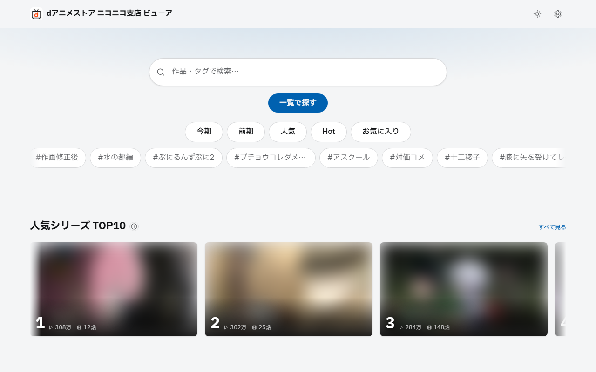

# dアニメストア ニコニコ支店 ビューア

**「dアニメストア ニコニコ支店」**の作品を探せる**非公式のビューア**です。

🔗 **サイト（公開中）**: https://emanon-i.github.io/nico-danime-viewer/

> ⚠️ 個人が趣味で作っている**非公式・非営利**のツールです。ドワンゴ／dアニメストアとは一切関係ありません。

---

## スクリーンショット



---

## これは何

dアニメストア ニコニコ支店で配信中のアニメを、**ランキング・タグ・五十音・放送クール**から
ザッピング感覚で探せる軽量な Web ページです。公式サイトでは埋もれがちな作品に出会いやすくすることが目的です。

**このサイトは動画を配信しません。** 作品を選ぶと**ニコニコの公式プレイヤーへ移動**します。

---

## 機能

| カテゴリ              | 内容                                                                                            |
| --------------------- | ----------------------------------------------------------------------------------------------- |
| **並び順**            | 人気（累計再生数）/ Hot（勢い）/ 平均再生 / 新着 / 初回放送 / コメント数 / 五十音 ＋ 昇順・降順 |
| **絞り込み**          | タグ・放送クール・尺（分）・公開年                                                              |
| **タグ検索**          | オートコンプリート付きタグ絞り込み                                                              |
| **五十音**            | あ行〜わ行で作品頭文字ブラウズ                                                                  |
| **クール**            | 今期・前期・過去クールから選択                                                                  |
| **作品詳細**          | 各話一覧・あらすじ・タグ一覧                                                                    |
| **お気に入り / 見た** | ブラウザ内（localStorage）に保存                                                                |
| **テーマ**            | ライト／ダーク／システム設定に追従                                                              |

---

## 使い方

1. サイト（GitHub Pages）を開く。
2. **ランキング／タグ／五十音／クール**から作品を探す。
3. 気になった作品を選ぶと、**ニコニコ公式の作品ページ（公式プレイヤー）へ移動**して視聴できます。

---

## スコープと注意

- **対象はニコニコ支店のみ。** dアニメストア本店（NTT DOCOMO・`animestore.docomo.ne.jp`）は
  ラインナップも視聴プレイヤーも異なる**別サービス**で、このサイトの対象外です。
- **非公式・個人制作・非営利。** 公式の機能・サポートではありません。
- **視聴にはニコニコ支店の会員と公式プレイヤーが必要です。** 本サイトは作品を探すビューアです。
- 作品データは**ニコニコの公開データから取得**しています（**新着はおおむね毎時、その他は日次**で更新）。

---

## 技術（ざっくり）

- 静的サイト（**Vite + TypeScript**）を **GitHub Pages** で配信。
- **GitHub Actions** がニコニコの公開データを取得し（新着は毎時・その他は日次）、静的 JSON に変換 → サイトが読み込み。
- ブラウザからは API を直接叩かず、あらかじめ用意した JSON だけを読むシンプルな構成です。
- お気に入り/見たマークはお使いのブラウザ内（localStorage）にのみ保存します（外部に送信しません）。

---

## 開発者向け

仕様は `docs/`（Tri-SSD）、データ取得の API リファレンスは `.claude/skills/` にあります。

```bash
pnpm install
pnpm fetch    # ニコニコ公開データから data/*.json を生成
pnpm dev      # ローカル開発サーバ
pnpm build    # 静的サイトをビルド（dist/）
```
