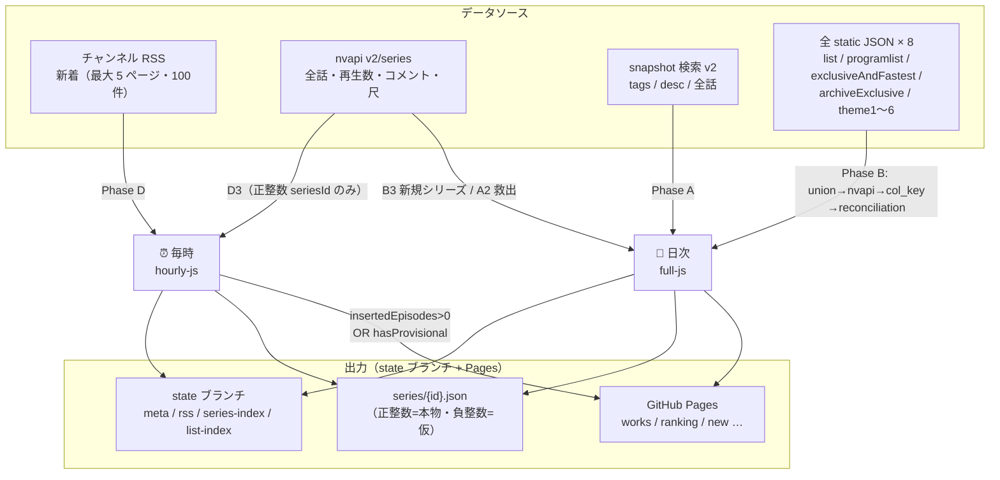
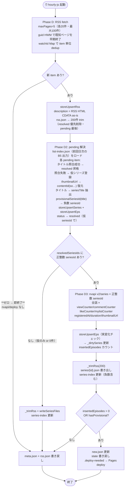

# データフロー仕様（L2）

> 2026-06-21 確定版。watch.mjs 廃止・全 static JSON union + nvapi authoritative + 仮シリーズ(SANDA型)を反映。

---

## 1. アーキテクチャ概要

```
外部API群
  │
  ▼
scripts/fetch.mjs（GitHub Actions 内・サーバなし）
  ├─ state ブランチ（meta.json / rss.json / prev-views.json / series-index.json / list-index.json）← 永続状態
  ├─ data/series/{id}.json（正整数 = 本物・負整数 = 仮シリーズ）← 系列別エピソードリスト
  └─ data/works.json 等（配信用 JSON）→ GitHub Pages
       ▲
       ブラウザは読み取るだけ（DB直叩きなし・CORS関係なし）
```

- **インメモリ Store**: `Map<seriesId, Series>` / `Map<contentId, Episode>` / `Map<watchId, RssItem>` を起動時にロード → 処理 → 書き出し
- **永続**: state ブランチ + `data/series/{id}.json` への atomic rename（tmp→本体）
- **2 ジョブ**: 毎時（hourly-js）/ 日次（full-js）
- **isAvailable**: snapshot 由来。`series.lastSeenAt` ＋ `meta.snapshotFetchedAt` で grace 付き評価（Phase E7）。仮シリーズ（seriesId < 0）は grace 対象外
- **seriesId 解決**: watch ページ不使用。全 static JSON union → nvapi authoritative が主経路。失敗時は仮シリーズ（負数 seriesId）を登録し、翌日の B6 reconciliation で本物に統合

---

## 2. フローチャート

### 2-1. 全体俯瞰図

どのデータソースをどのジョブが使い、何を出力するかを示す。



---

### 2-2. 毎時フロー

**設計方針**: RSS pending item → list-index（タイトル照合）で seriesId 解決。照合失敗は仮シリーズ登録。正整数 seriesId のみ nvapi で全話更新。watch ページは使わない。

**判定ルール:**

1. **RSS 新着ゼロ → 即終了**（list-index 照合・nvapi・デプロイ一切なし）
2. `pending` item → list-index 照合（正規化タイトル前方一致）
3. 照合成功 → `resolved` 昇格（resolvedSeriesIds に追加）
4. 照合失敗 → 仮シリーズ登録（thumbnailUrl → contentId 復元・タイトル抽出・負数 seriesId）
5. **D3 = 正整数 seriesId のみ**（`resolvedSeriesIds.filter(sid => sid > 0)`）
6. **deploy = `insertedEpisodes > 0 || hasProvisional`**（新着 ep 追加 OR 仮シリーズあり → deploy）



---

### 2-3. 日次フロー

**早期 exit ルール**: **version gate 変化なし → 即終了**（B/A2/E/deploy は一切走らない）

日次の処理順: Phase A（snapshot） → Phase B（全 static JSON union） → Phase A2（取得漏れ救出） → Phase E（ETL） → detectShrink → deploy

```mermaid
flowchart TD
    A(["📅 full-js 起動\nJST 07:30"]) --> B["snapshot/version 取得"]
    B --> C{"version gate\nlast_modified 変化?"}
    C -->|"**変化なし → 即終了**\nB/A2/E/deploy は走らない"| ENDEARLY([" 終了（早期）"])
    C -->|"変化あり"| D["Phase A: snapshot 全件取得\n年ウィンドウ分割 ≈17分\nupsertEps（viewCounter/tags/desc/…）\n→ missedContentIds 収集（seriesId=null の ep）\n→ meta.snapshotFetchedAt = now"]
    D --> P["Phase B: 全 static JSON union（8 本）\nlist.json / programlist.json /\nexclusiveAndFastest.json / archiveExclusive.json /\ntheme1〜6.json"]
    P --> B2["B2: 各 JSON から href=/series/<id> または series:<数値> 抽出\n全 seriesId を Set に union"]
    B2 --> B3["B3: store 未保有の新 seriesId → nvapi v2/series authoritative\n全話取得・シリーズタイトル取得\n→ storeUpsertEps + storeUpsertSeries"]
    B3 --> B4["B4: list.json 掲載シリーズに\ncol_key パッチ + isAvailable=true 強制"]
    B4 --> B5["B5: list-index.json 保存\n（タイトル→seriesId Map・毎時 D2 が参照）"]
    B5 --> B6["B6: 仮シリーズ(seriesId<0) × allTitles 完全一致 reconciliation\n→ nvapi 検証（支店判定 + 仮 ep の contentId が nvapi 話一覧に存在）\n→ 検証 OK: ep の seriesId を実 ID に付け替え\n→ store.series.delete(仮 id)\n→ data/series/<neg>.json 削除（再インジェスト防止）"]
    B6 --> A2["Phase A2: 取得漏れ救出\n① store の contentId→seriesId Map で直接解決\n② タグ/タイトル照合（最終手段）→ nvapi → ep 付け替え\n③ 全失敗 → 仮シリーズ登録（thumbnailUrl→contentId・負数 seriesId）"]
    A2 --> LS["lastSeenAt = now\n（snapshot 出現シリーズのうち seriesId > 0）"]
    LS --> E["Phase E: ETL 派生\nE1: descriptionFirst（最古話 description）\nE2: tags 正規化（dアニメ接頭/接尾除去）\nE3: cours（タグ主源）\nE4: franchiseKey + relatedSeries\nE5: timestamps 同期\nE6: thumbnails 同期\nE7: isAvailable grace\n    snapshotFetchedAt > 3日前 → 評価スキップ\n    lastSeenAt < (snapshotFetchedAt - 2日) → false\n    ※ seriesId < 0（仮）は grace スキップ（isAvailable 固定 true）"]
    E --> F{"detectShrink\nep>0件数 < baseline×90%?"}
    F -->|"縮小検出"| G["meta.json のみ保存\nexport/deploy スキップ"]
    F -->|"正常"| H2["Phase F: writeBackStore\n（_dirtySeries の series/*.json\n+ state/*.json 全量）\nPhase G: projectAll\nworks/ranking/tags/kana/new 生成\n.deploy-needed → Pages deploy"]
    G --> END([" 終了"])
    H2 --> END
```



---

## 3. データソース別取得情報（採用ソースのみ）

| データソース             | 利用ジョブ            | URL                                                                                                                                        | 取得できるもの                                                                                                   | 注意点                                                                                                                               | 実測値                |
| ------------------------ | --------------------- | ------------------------------------------------------------------------------------------------------------------------------------------ | ---------------------------------------------------------------------------------------------------------------- | ------------------------------------------------------------------------------------------------------------------------------------ | --------------------- |
| **snapshot 検索 v2**     | 日次 Phase A          | `snapshot.search.nicovideo.jp/api/v2/snapshot/video/contents/search`                                                                       | contentId(so…) / title / viewCounter / tags / startTime / thumbnailUrl / channelId / description / lengthSeconds | seriesId フィールドなし。channelId フィルタ不可（取得後にコードで絞る）。`fields=`（アンダースコアなし）が正しい                     | ≈550ms/req・全体≈17分 |
| **チャンネル RSS**       | 毎時 Phase D          | `ch.nicovideo.jp/ch2632720/video?rss=2.0`                                                                                                  | watchId（数値）/ title / pubDate / guid / link / description（HTML CDATA）/ thumbnailUrl（media:thumbnail）      | contentId(so…)・seriesId は含まれない                                                                                                | ≈400ms                |
| **nvapi v2/series/{id}** | 毎時 D3 / 日次 B3・A2 | `nvapi.nicovideo.jp/v2/series/<seriesId>`                                                                                                  | 全話一覧（contentId/so…・話順）/ count.{view,comment,mylist,like} / registeredAt / duration / thumbnailUrl       | **tags・description フィールドなし**（snapshot が唯一）。正整数 seriesId が事前に判明している必要あり。負数（仮 ID）では呼び出さない | ≈550ms                |
| **全 static JSON × 8**   | 日次 Phase B          | `site.nicovideo.jp/danime/static/data/` + list.json / programlist.json / exclusiveAndFastest.json / archiveExclusive.json / theme1〜6.json | seriesId 一覧 / col_key（list.json のみ・五十音唯一の取得源）                                                    | Promise.allSettled で並列取得・失敗 JSON はスキップ。col_key は list.json 固有                                                       | ≈150〜300ms           |

### snapshot の重要制約

- **`fields=`（アンダースコアなし）** が正しいパラメータ名。`_fields=` を使うと `data: []` になる（実測確認）
- `_sort` 必須
- `_offset` 上限 100,000 → **年ウィンドウ分割**（2012〜現在）で回避
- `filters[channelId][0]=2632720` は URL エンコードで壊れるため**取得後にコードで絞る**

---

## 4. seriesId 解決の経路

**watchページは使わない。** seriesId は以下の優先順で解決する。

### 主経路: 全 static JSON union → nvapi（日次 Phase B）

1. `site.nicovideo.jp/danime/static/data/` 配下の 8 本の静的 JSON を並列取得
2. 各 JSON の `href: "/series/<id>"` または `series: <数値>` フィールドから seriesId を抽出
3. store に未登録の新 seriesId → `nvapi v2/series/<id>` で authoritative 取得（全話・タイトル）
4. 取得結果を storeUpsertEps・storeUpsertSeries に反映

これで **dアニメストアニコニコ支店の全掲載シリーズ**を毎日全量カバーする。

### 補助経路: list-index タイトル照合（毎時 D2 / 日次 A2）

前回日次の B5 で保存した `list-index.json`（タイトル→seriesId の Map）を用いた前方一致照合。

- タイトル前方一致 + 語境界ガード（`/^[\s第#（(「『[【・\d]/`）で偽陽性を防ぐ
- タグ正規化（アンダースコア→スペース）からも照合試みる
- これは**最終手段**であり、主経路（B3 nvapi）が充足している場合は実質不要

### 仮シリーズ（SANDA 型）: 照合全失敗時のフォールバック

照合が全失敗した ep に対して、タイトルから seriesTitle を抽出し `provisionalSeriesId(title)` で負数 seriesId を生成してシリーズを仮登録する（§4-1 参照）。

### Phase A2: 取得漏れ救出ループ（日次）

snapshot に登場したが seriesId が未解決の ep を救出する。

```
1. store の contentId→seriesId Map に既にある → 直接解決（nvapi 不要）
2. ep のタグ/タイトル照合 → seriesId 候補 → nvapi v2/series → 全話取得 → ep 付け替え
   2b. nvapi 失敗でも list.json 掲載作品なら seriesId を確定（applyListJsonRescue）:
       list-index.json のタイトル照合で seriesId が得られた場合、nvapi エラーでも
       list.json 掲載＝支店公式ラインナップ確認済みを権威として seriesId を確定する。
       nvapi 再試行なし・ep は確定 seriesId で付け替え。
3. 全失敗 → 仮シリーズ登録（thumbnailUrl → contentId 復元・provisionalSeriesId）
```

---

### 4-1. 仮シリーズ（SANDA 型）の仕組み

| 項目                   | 内容                                                                                                                                                                                                                                   |
| ---------------------- | -------------------------------------------------------------------------------------------------------------------------------------------------------------------------------------------------------------------------------------- |
| **seriesId**           | `provisionalSeriesId(seriesTitle)` が返す**負整数**（決定的・再実行で同値）                                                                                                                                                            |
| **ハッシュ式**         | djb2 変形: `h = Math.imul(h,31) + ch.codePointAt(0) \| 0`（全文字）。`h <= 0 ? h-1 : -h` で必ず負数                                                                                                                                    |
| **contentId 復元**     | `thumbnailUrl` の `/thumbnails/<N>/` → `so<N>` （`contentIdFromThumbnail`）                                                                                                                                                            |
| **seriesTitle 抽出**   | `extractSeriesTitle`（「第N話」「#N」「Episode N」前の語を抽出）                                                                                                                                                                       |
| **フロント表示**       | `seriesId < 0` → 公式シリーズページボタンを disabled + ツールチップ「公式シリーズ情報を取得中です」                                                                                                                                    |
| **isAvailable**        | 仮登録時は `true`（E7 grace 対象外・仮のまま）                                                                                                                                                                                         |
| **解消タイミング**     | 翌日の Phase B3（nvapi authoritative）で本物 seriesId が登録され B6 で統合                                                                                                                                                             |
| **B6 reconciliation**  | 仮 seriesId × allTitles 完全一致 → nvapi 検証（支店判定 + 仮 ep の contentId が nvapi 話一覧に存在）→ 検証 OK: ep の seriesId を実 ID に付け替え → `store.series.delete(負数ID)` → `data/series/<neg>.json` 削除（再インジェスト防止） |
| **ハッシュ衝突リスク** | 32-bit ハッシュで異なるタイトルが同じ負数になる確率 ≈ 2^-32。実用上許容                                                                                                                                                                |

---

## 5. 2 ジョブの詳細

### 全体トリガー

| ジョブ   | cron（UTC）   | JST 相当     | コマンド                    |
| -------- | ------------- | ------------ | --------------------------- |
| **毎時** | `0 * * * *`   | 毎時 00 分   | `--mode=hourly`             |
| **日次** | `30 22 * * *` | 翌 07:30 JST | `--mode=full`（デフォルト） |

**cron タイミング**:
snapshot 索引は毎日 **UTC 22:06 頃**に更新される（実測）。日次 cron は `30 22 * * *`（UTC 22:30）なので **24 分の余裕**がある。索引更新が遅延して 22:30 時点で前回値と同じ場合、version gate がスキップ → 翌日自動回収（保守的設計）。強制実行: `NICO_FORCE_SNAPSHOT=1`。

---

### ジョブ①: hourly-js（毎時）— `runHourlyJS()`

```
Phase D  : RSS fetch
              maxPages=5（各ページ 20件・最大 100件）
              guid HWM（filterNewRssItems）でページ単位の早期終了
              watchId Map で item 単位の重複除外
              新 RSS item ゼロ → meta.json + rss.json 書き戻し → 即終了
                                  （list-index 照合・nvapi・デプロイは一切走らない）
              新 RSS item あり → storeUpsertRss
                                  description = RSS <description> HTML CDATA as-is
                                  thumbnailUrl = <media:thumbnail url="..."> から抽出
                                  rss.json → 最大 200 件に trim（resolved 優先削除・pending 最後）

Phase D2 : pending 解決
              list-index.json（前回日次 B5 出力）をロード
              pending item ごとに:
                タイトル照合成功 → resolved 昇格（resolvedSeriesIds に正整数追加）
                タイトル照合失敗 → 仮シリーズ登録:
                  thumbnailUrl → contentIdFromThumbnail → contentId(so…)
                  extractSeriesTitle(title) → seriesTitle
                  provisionalSeriesId(seriesTitle) → 負数 seriesId
                  storeUpsertSeries + storeUpsertEps
                  storeUpdateRssResolution(watchId, contentId, 'resolved')
                  → resolvedSeriesIds に負数追加

Phase D3 : nvapi 更新（正整数 seriesId のみ）
              負数（仮 seriesId）は D3 をスキップ（nvapi に負数 ID は存在しない）
              実 seriesId あり → nvapi v2/series × seriesId 数
                              全話 × viewCounter/commentCounter/likeCounter/mylistCounter
                                   / registeredAt / duration / thumbnailUrl を取得
                              storeUpsertEps（実変化チェック → _dirtySeries 更新）
                              insertedEpisodes カウント（series-index 未登録の ep）

書き出し: _dirtySeries 非空 → series/{id}.json + series-index 更新（負数 seriesId ファイルも書き出す）
deploy  : insertedEpisodes > 0 || hasProvisional → .deploy-needed → Pages deploy
state   : meta.json + rss.json 書き戻し（常時）
export  : new.json 更新（常時）
```

**設計のポイント**:

- タイトル照合は `list-index.json`（前回日次の B5 出力）に依存。初回実行や日次未走行時は空 Map → 照合スキップ（仮シリーズ登録のみ）
- 仮シリーズは D3 をスキップするが、翌日の B6 reconciliation で本物に統合される
- watch ページ不使用のため bot 検知リスクなし
- **deploy は `insertedEpisodes > 0 || hasProvisional`**。新着 ep 追加 OR 仮シリーズが存在する場合にのみ Pages deploy。再生数更新はファイルに反映されるが Pages deploy は伴わない

---

### ジョブ②: full-js（日次）— `runFullJS()`

**役割**: snapshot で全話の viewCounter / tags / description を最新化 ＋ 全 static JSON union で新シリーズ取込 ＋ 仮シリーズ reconciliation ＋ ETL 派生（isAvailable grace 含む）。毎日無条件 deploy する。

```
version gate チェック（最初に実行・早期 exit 判定）:
              storedVersion === newVersion → **即終了**（何も書き出さない・deploy なし）
                                            B/A2/E/detectShrink/deploy は一切走らない
              新版なら: 以下を実行

Phase A  : snapshot 全件取得
              storeUpsertEps: viewCounter / tags / description 等を更新
              missedContentIds 収集（channelId=2632720 かつ seriesId=null の ep）
              meta.snapshotFetchedAt = now / snapshotVersionLastModified 更新

Phase B  : 全 static JSON union（8 本並列取得）
              B2: 各 JSON から seriesId 抽出 → Set union
              B3: store 未保有の新 seriesId → nvapi authoritative 取得
                  storeUpsertEps（全話）+ シリーズタイトル設定
              B4: list.json 掲載シリーズ → col_key パッチ + isAvailable=true 強制
              B5: list-index.json 保存（タイトル→seriesId Map）
              B6: 仮シリーズ（seriesId < 0）× allTitles 完全一致 reconciliation
                  → nvapi 検証（支店判定 + 仮 ep の contentId が nvapi 話一覧に存在）
                  → 検証 OK: ep の seriesId を実 ID に付け替え
                  → store.series.delete(仮 id)
                  → data/series/<neg>.json を existsSync + unlinkSync で削除

Phase A2 : 取得漏れ救出（Phase B 後・allTitles が充実した状態で実行）
              ① store の contentId→seriesId Map で直接解決
              ② タグ/タイトル照合（最終手段）→ seriesId → nvapi → ep 付け替え
              ③ 全失敗 → 仮シリーズ登録

lastSeenAt: snapshot 出現シリーズ（seriesId > 0）に lastSeenAt = now を記録

Phase E  : ETL 派生
              E1: series.descriptionFirst（最古話 description・long-wins: 複数源の description は長い方を保持）
              E2: series.tags（タグ正規化・dアニメ接頭/接尾除去・作品名タグ除外）
              E3: cours（タグ主源 → 213クール・約3900作品を網羅）
              E4: franchiseKey（タイトル語幹 + シリーズタグ union-find）+ relatedSeries
              E5: timestamps 同期
              E6: thumbnails 同期
              E7: isAvailable grace
                  snapshotFetchedAt が 3 日以上前 → 評価しない（連続スキップ保護）
                  lastSeenAt < (snapshotFetchedAt - 2日) → isAvailable = false
                  再出現（lastSeenAt 更新済み） → isAvailable = true
                  ※ seriesId < 0（仮シリーズ）は grace スキップ（isAvailable 固定 true）
              E8: prevViewCounter delta（hot スコア）

回帰ガード: detectShrink: countSeriesWithEpisodes(store) < Math.floor(baseline × 0.9)
              → export スキップ。meta.json のみ保存して終了

Phase F  : writeBackStore（_dirtySeries の series/*.json + state/*.json 全量）← atomic
Phase G  : projectAll（works / ranking / tags / kana / new 等）← 非 atomic（async writeFile）
           → .deploy-needed → Pages deploy（毎回・shrink 除く）
```

**毎時 vs 日次の更新フィールド分担**:

| フィールド                   | 更新ジョブ    | 源                                |
| ---------------------------- | ------------- | --------------------------------- |
| viewCounter / commentCounter | 毎時 (D3)     | nvapi v2/series                   |
| likeCounter / mylistCounter  | 毎時 (D3)     | nvapi v2/series                   |
| registeredAt（投稿時間）     | 毎時 (D3)     | nvapi v2/series                   |
| duration                     | 毎時 (D3)     | nvapi v2/series                   |
| tags                         | 日次 (A + E2) | snapshot                          |
| lengthSeconds                | 日次 (A)      | snapshot                          |
| description（canonical）     | 日次 (A + E1) | snapshot                          |
| description（暫定）          | 毎時 (D)      | RSS HTML CDATA as-is              |
| seriesTitle / 話順           | 日次 B3 / A2  | nvapi v2/series                   |
| cours / franchiseKey         | 日次 (E3/E4)  | タグ派生                          |
| col_key（五十音）            | 日次 (B4)     | list.json                         |
| isAvailable                  | 日次 (E7)     | snapshot 由来（lastSeenAt grace） |
| lastSeenAt                   | 日次 (A)      | snapshot 出現確認                 |

---

## 6. ストレージ・JSON の実装詳細

| 項目                 | 詳細                                                                                              |
| -------------------- | ------------------------------------------------------------------------------------------------- |
| **ファイル I/O**     | Node.js `fs`（同期）+ JSON.parse / JSON.stringify                                                 |
| **永続ストア**       | `data/state/meta.json` / `rss.json` / `prev-views.json` / `series-index.json` / `list-index.json` |
| **シリーズ別**       | `data/series/{id}.json`（正整数=本物・負整数=仮シリーズ）                                         |
| **atomic write**     | `.tmp` に書いて `renameSync` で置換（state/\*.json・series/\*.json）                              |
| **projection write** | async `writeFile`（非 atomic）。projectAll 毎回フル再生成                                         |
| **rss.json trim**    | 200件 cap。resolved 優先削除 → pending は最後まで保持                                             |
| **並列制御**         | nvapi 連続 req は `fetchWithToS` の ToS 待機で自動制御                                            |
| **律速**             | I/O は全体の 0.3% 以下。律速はネットワーク（snapshot ≈17分）                                      |
| **Store 汚染追跡**   | `store._dirtySeries: Set<number>`（実変化のあったシリーズのみ追跡）                               |
| **回帰ガード閾値**   | `baseline`（works.json の episodeCount > 0 件数）× 0.9 を下回ったら export スキップ               |

**Series フィールド（isAvailable 関連）**:

| フィールド   | 型               | 説明                                    |
| ------------ | ---------------- | --------------------------------------- |
| `lastSeenAt` | `string \| null` | snapshot に最後に登場した ISO 8601 日時 |

**meta フィールド**:

| フィールド          | 型               | 説明                                                                            |
| ------------------- | ---------------- | ------------------------------------------------------------------------------- |
| `snapshotFetchedAt` | `string \| null` | Phase A 完全実行が完了した ISO 8601 日時（version gate スキップ時は更新しない） |

---

## 7. 現在の数値（2026-06-21 時点）

| 項目                        | 値                                                 |
| --------------------------- | -------------------------------------------------- |
| data/series/{id}.json 件数  | 6352 + 仮シリーズ（変動）                          |
| works.json: 総シリーズ数    | ≈6352                                              |
| works.json: episodes > 0    | ≈6299                                              |
| state/rss.json: RSS 件数    | ≈40                                                |
| state/rss.json: pending     | 変動（B6 reconciliation で解消・再発生を繰り返す） |
| state/rss.json: resolved    | 大部分                                             |
| snapshotVersionLastModified | 2026-06-16T07:08:11+09:00                          |

---

## 8. 判定ポイント詳細

---

### 8-1. RSS 新着判定

| 項目           | 内容                                                                                             |
| -------------- | ------------------------------------------------------------------------------------------------ |
| **条件**       | 毎時 hourly-js が起動するたびに判定                                                              |
| **何を取るか** | RSS を最大 5 ページ（100件）取得。guid HWM でページ単位早期終了・watchId Map で item 単位 dedup  |
| **何をするか** | 新 item ゼロ → 即終了（list-index 照合/nvapi/deploy なし）。あり → storeUpsertRss → 以降の処理へ |
| **注意**       | rss.json は 200件 cap で trim（resolved 優先削除・pending 最後）                                 |

---

### 8-2. version gate（snapshot `last_modified` 前回比）

| 項目                       | 内容                                                                                          |
| -------------------------- | --------------------------------------------------------------------------------------------- |
| **条件**                   | 日次 full-js Phase A で毎回チェック                                                           |
| **何を取るか**             | `GET /api/v2/snapshot/version` の `last_modified` 文字列（ISO 8601）                          |
| **どう判定**               | `store.meta.snapshotVersionLastModified` と文字列一致比較。一致 → Phase A skip、不一致 → 実走 |
| **スキップ時（変化なし）** | **即終了**。B/A2/E/deploy は走らない。`snapshotFetchedAt` は更新しない。何も書き出さない      |
| **実走時**                 | 全年ウィンドウ（2012〜現在）× 100件ページング → `storeUpsertEps` → `snapshotFetchedAt` 更新   |
| **タイミング**             | 索引更新（UTC 22:06 頃）後に日次（UTC 22:30）が走るのが通常。遅延時は翌日自動回収             |
| **強制実行**               | `NICO_FORCE_SNAPSHOT=1` で version gate をバイパスして常に全件取得                            |

---

### 8-3. 変更あり判定（`_dirtySeries` / `insertedEpisodes`）

| 項目                        | 毎時                                                                   | 日次                                                            |
| --------------------------- | ---------------------------------------------------------------------- | --------------------------------------------------------------- |
| **dirty 追跡の型**          | `_dirtySeries: Set<number>`                                            | 同左                                                            |
| **dirty トリガー**          | viewCounter / tags / 新 ep 挿入・仮シリーズ登録                        | 同左（＋ upsertSeries は常に dirty）                            |
| **series/\*.json 書き出し** | `_dirtySeries 非空` → 対象のみ（`writeSeriesFiles`）                   | `_dirtySeries 非空` → 対象のみ（`writeBackStore`）              |
| **state/\*.json 書き出し**  | meta.json + rss.json を個別書き出し                                    | prev-views / meta / rss / series-index 全量（`writeBackStore`） |
| **Pages deploy の条件**     | **`insertedEpisodes > 0 \|\| hasProvisional`** → `.deploy-needed` 生成 | **毎回**（detectShrink 除く）                                   |
| **count 変化のみの場合**    | ファイル更新のみ（deploy なし）→ 翌日の日次 deploy で反映              | 毎日デプロイで常に最新                                          |

---

### 8-4. detectShrink（ep>0件数 < baseline × 90%）

| 項目           | 内容                                                                       |
| -------------- | -------------------------------------------------------------------------- |
| **条件**       | 日次 full-js Phase E 完了直後・export 前に実行                             |
| **何を取るか** | Store の `countSeriesWithEpisodes(store)` と `data/works.json`（baseline） |
| **どう判定**   | `baseline > 0 && count < Math.floor(baseline * 0.9)` → shrink=true         |
| **動作**       | shrink=true → `meta.json` のみ atomic write → export/deploy スキップ       |
| **目的**       | 部分ロード等で Store が痩せた状態で上書きするのを防ぐ（保守的設計）        |

---

### 8-5. pending 判定と解決フロー

| 項目                             | 内容                                                                                                                                                                  |
| -------------------------------- | --------------------------------------------------------------------------------------------------------------------------------------------------------------------- |
| **pending とは**                 | RSS で取得したが seriesId への対応付けが未解決。`resolutionStatus === 'pending'`                                                                                      |
| **いつ発生するか**               | RSS の watchId に対応する ep が store に未登録（新シリーズ or snapshot 未反映）                                                                                       |
| **毎時の解決方法① タイトル照合** | list-index.json（前回日次 B5 出力）の タイトル→seriesId Map で前方一致照合 → 成功で `resolved` 昇格                                                                   |
| **毎時の解決方法② 仮シリーズ**   | 照合失敗 → thumbnailUrl → contentId 復元・タイトル抽出・provisionalSeriesId → 負数 seriesId で仮登録・`resolved`（仮 ID）昇格                                         |
| **翌日の B6 reconciliation**     | 仮シリーズタイトル × allTitles 完全一致 → nvapi 検証（支店判定 + 仮 ep の contentId が nvapi 話一覧に存在）→ 検証 OK: 本物 seriesId に統合・仮 series/{neg}.json 削除 |
| **B6 非一致時**                  | 仮シリーズのまま保持。B3 で本物が取り込まれた翌日に自動解消                                                                                                           |
| **タイトル照合（廃止扱い）**     | watch ページ依存の旧タイトル照合は廃止。list-index を「主経路」、タグ/タイトル照合は「最終手段」                                                                      |

---

### 8-6. 支店判定（channelId === 2632720）

| 場所                | 判定方法                                                                   | タイミング                   |
| ------------------- | -------------------------------------------------------------------------- | ---------------------------- |
| **snapshot 取得後** | `ep.channelId === 2632720`（数値比較）                                     | Phase A の storeUpsertEps 前 |
| **nvapi v2/series** | `ep.channelId` で確認（nvapi 自体はフィルタ不可）                          | B3/A2/D3 のコールバック内    |
| **注意**            | snapshot は数値 `2632720`（数値）/ nvapi は文字列 `"ch2632720"` の場合あり |

---

### 8-7. isAvailable grace（snapshot 不在 + 猶予期間）

| 項目                        | 内容                                                                                          |
| --------------------------- | --------------------------------------------------------------------------------------------- |
| **評価タイミング**          | 日次 Phase E7（Phase A 完了後）                                                               |
| **必要フィールド**          | `series.lastSeenAt` / `meta.snapshotFetchedAt`                                                |
| **非評価条件①**             | `snapshotFetchedAt` が 3 日以上前 → 評価しない（version gate 連続スキップ保護）               |
| **非評価条件②**             | `seriesId < 0`（仮シリーズ）→ grace スキップ。isAvailable は仮登録時の `true` を維持          |
| **false 判定式**            | `lastSeenAt < (snapshotFetchedAt - 2日)` → `isAvailable = false`                              |
| **復活条件**                | snapshot に再登場 → `lastSeenAt` が更新 → 次の Phase E7 で `isAvailable = true`               |
| **version gate スキップ時** | `snapshotFetchedAt` は更新しない → 連続スキップが続くと非評価状態に入り false positive を防ぐ |
| **list.json との関係**      | list.json 掲載 → isAvailable=true 強制（B4）。これは snapshot 不在でも掲載中を意味するため    |

---

## 9. データライフサイクル 4 分類表

| 分類                            | ファイル                                                                                          | 挙動                                                                                                  | atomic?             |
| ------------------------------- | ------------------------------------------------------------------------------------------------- | ----------------------------------------------------------------------------------------------------- | ------------------- |
| **1. 永続・増分更新**           | `state/meta.json` / `state/series-index.json` / `state/list-index.json` / `data/series/{id}.json` | 更新ごとに書き出し。削除しない（仮 series/{neg}.json は B6 で明示削除）。Store が全データの正規コピー | ✓ (.tmp→rename)     |
| **2. 派生・毎回全件生成**       | `works.json` / `ranking.json` / `tags.json` / `kana.json` / `new.json` 等                         | `projectAll` 毎回フル再生成。Store から完全導出可能。破損しても再実行で復元                           | ✗ (async writeFile) |
| **3. 保持上限あり（循環削除）** | `state/rss.json`                                                                                  | 200件 cap。resolved 優先削除。pending は最後まで保持                                                  | ✓ (.tmp→rename)     |
| **4. 1 日サイクル上書き**       | `state/prev-views.json`                                                                           | 日次開始前に `{contentId: viewCounter}` を保存。Phase E8 が delta 計算後、翌日上書き                  | ✓ (.tmp→rename)     |

**特殊挙動**:

- `data/series/{id}.json`: 正整数=本物・負整数=仮シリーズ。hourly は `_dirtySeries` 対象のみ書き出し（全量ではない）
- `state/*.json`: hourly は meta + rss のみ個別書き出し。daily は全量 writeBackStore
- `new.json`: hourly も daily も毎回上書き（rss.json 先頭スライス）
- isAvailable=false のシリーズもすべて保持（ソフトトゥームストーン）
- **仮 series/{neg}.json**: B6 reconciliation で統合後に `unlinkSync` で明示削除（次回 loadStore での再インジェスト防止）

---

## 10. フロント表示契約

### isAvailable=false のシリーズの扱い

| 項目                | 契約                                                                       |
| ------------------- | -------------------------------------------------------------------------- |
| **データ**          | Store・`data/series/{id}.json`・`works.json` すべてに保持（削除しない）    |
| **works.json 出力** | `isAvailable: false` のシリーズも含める（`thumbnailUrl` フィールドも出力） |
| **デフォルト表示**  | 一覧から非表示（フロントがフィルタ）                                       |
| **設定トグル**      | ユーザーが「配信終了作品を表示」をオンにすると表示                         |

### 仮シリーズ（seriesId < 0）の表示

| 項目               | 契約                                                                                              |
| ------------------ | ------------------------------------------------------------------------------------------------- |
| **判定**           | `series.seriesId < 0`                                                                             |
| **カード**         | 公式シリーズページの外部リンクボタンを `disabled` + `data-tooltip="公式シリーズ情報を取得中です"` |
| **詳細画面**       | 公式シリーズページボタンを `disabled` + ツールチップ                                              |
| **ソート順**       | 実シリーズと**同一キーで混合ソート**（末尾分離なし）。固有の挙動は公式リンク無効のみ              |
| **解消タイミング** | 翌日の B6 reconciliation 後に正整数 seriesId に統合 → 通常表示に戻る                              |

### カード表示仕様

| 状態                  | サムネあり                                                  | サムネなし                      |
| --------------------- | ----------------------------------------------------------- | ------------------------------- |
| **isAvailable=false** | サムネ画像 ＋ 半透明グレーオーバーレイ ＋「取得不可」ラベル | グレー背景 ＋「取得不可」ラベル |
| **isAvailable=true**  | 通常表示                                                    | グレー背景（ラベルなし）        |

**ラベル**: `"取得不可"` 1種類のみ（「配信終了」との区別はしない。snapshot 不在理由はコードから判断不能）

### kana.json（五十音ナビ）の変更

- `isAvailable=true` 条件を除外。`colKey` が null でないシリーズのみ出力（isAvailable 問わず）

---

## 11. 難所・注意点

### 11-1. version gate と cron のタイミング依存

**状況**: 日次 cron（UTC 22:30）と snapshot 索引更新（UTC 22:06 頃）の間に 24 分の余裕がある。索引更新が遅延すると version gate がスキップ → **その日の Phase A が実質空振り**。連続しても翌日以降で自動回収（保守的設計）。

**検知**: `snapshotVersionLastModified` が複数日同じ値のまま → ログで確認。

**強制手段**: `NICO_FORCE_SNAPSHOT=1` で手動トリガー可能。

**isAvailable への影響**: version gate スキップ（即終了）が 3 日以上続くと `snapshotFetchedAt` が古くなり Phase E7 の評価が停止（false positive 防止）。長期スキップ時は `NICO_FORCE_SNAPSHOT=1` での強制実行を推奨。

---

### 11-2. nvapi / snapshot の 503 バックオフで日次が伸びる

**状況**: `fetchWithToS` は 503 を受けると `backoff503Ms`（5分）待機してから1回リトライする。

**影響**: snapshot 全件取得（≈17分）の途中で 503 → 最大 +5分延長。

**設計**: 503 後のリトライが失敗したら例外を throw → Actions が fail → 前回の正常な公開物を保持。

---

### 11-3. list.json の col_key は唯一の代替なし

**状況**: 五十音ナビ（kana.json）の読み情報は list.json の `col_key` フィールドが唯一の源。snapshot / nvapi / RSS のいずれも読み情報を提供しない。

**影響**: list.json が取得できないと col_key が更新されず、kana.json の五十音分類が陳腐化する。

**設計**: list.json は col_key パッチと seriesId union に役割を絞る（isAvailable の主判定には使わない）。

---

### 11-4. 仮シリーズのハッシュ衝突

**状況**: `provisionalSeriesId` は 32-bit ハッシュで負数を生成するため、異なるタイトルが同じ負数になる確率が ≈ 2^-32 存在する。

**影響**: 衝突時は B6 reconciliation で誤った ep が付け替わる可能性があるが、nvapi 検証（支店判定 + 仮 ep の contentId が nvapi 話一覧に存在）で大幅に緩和。残余リスクは確率 ≈ 2^-32 のため実用上許容。

**本物との区別**: 本物 seriesId は必ず正整数。仮は必ず負整数。重複しない。

---

### 11-5. B4 isAvailable=true 強制の副作用

**状況**: Phase B4 では list.json 掲載シリーズに `isAvailable=true` を強制する。list.json は掲載中作品のみを含むという前提に基づく。

**リスク**: list.json から削除済みの作品が B4 で誤って `true` に戻される可能性。ただし list.json は現在掲載中のリストなので通常このケースは発生しない。

**緩和**: Phase E7 の isAvailable grace が翌日以降に snapshot 不在を検出して `false` に戻す。
