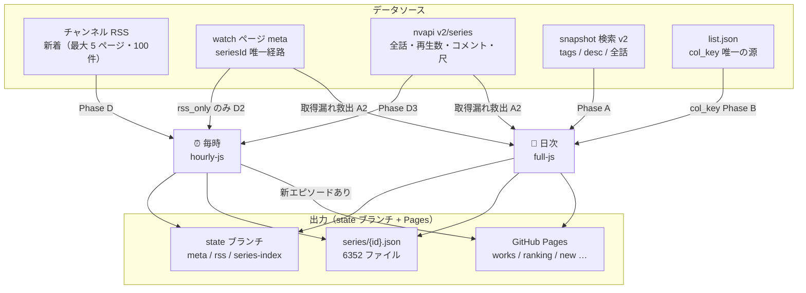
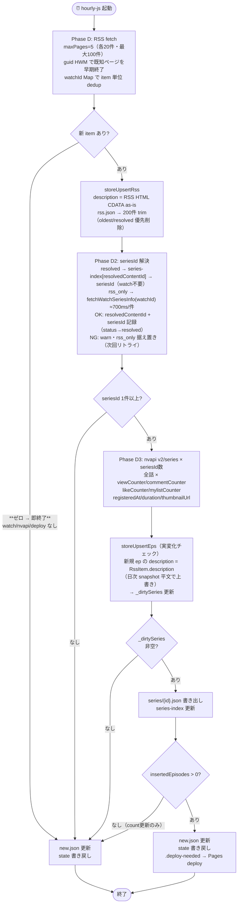
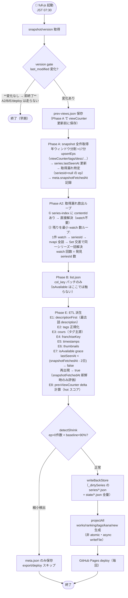

# データフロー仕様（L2）

> 2026-06-20 確定版。実測裏取り済みの値のみ記載。インメモリ Store・JSON ファイル永続構成。

---

## 1. アーキテクチャ概要

```
外部API群
  │
  ▼
scripts/fetch.mjs（GitHub Actions 内・サーバなし）
  ├─ state ブランチ（meta.json / rss.json / prev-views.json / series-index.json）← 永続状態
  ├─ data/series/{id}.json（6352 ファイル）← 系列別エピソードリスト
  └─ data/works.json 等（配信用 JSON）→ GitHub Pages
       ▲
       ブラウザは読み取るだけ（DB直叩きなし・CORS関係なし）
```

- **インメモリ Store**: `Map<seriesId, Series>` / `Map<contentId, Episode>` / `Map<watchId, RssItem>` を起動時にロード → 処理 → 書き出し
- **永続**: state ブランチ + `data/series/{id}.json` への atomic rename（tmp→本体）
- **2 ジョブ**: 毎時（hourly-js）/ 日次（full-js）
- **isAvailable**: snapshot 由来。`series.lastSeenAt` ＋ `meta.snapshotFetchedAt` で grace 付き評価（Phase E7）

---

## 2. フローチャート

### 2-1. 全体俯瞰図

どのデータソースをどのジョブが使い、何を出力するかを示す。



---

### 2-2. 毎時フロー

**設計方針**: RSS watchId → seriesId（series-index または watch page 経由）→ nvapi v2/series でシリーズ全話の再生数/コメント数/尺を一括更新。tags / description（canonical）は日次 snapshot が担当。

**判定ルール（これだけ）:**

1. **RSS 新着ゼロ → 即終了**（watch 取得・nvapi・デプロイ一切なし）
2. `resolved` item → `resolvedContentId` → `series-index` で seriesId 解決（watch 不要）
3. `rss_only` item のみ watch ページ取得（通常 0〜5件/時）
4. **deploy = `insertedEpisodes > 0` のみ**（count 更新だけなら deploy なし）



---

### 2-3. 日次フロー

**早期 exit ルール（毎時の「RSS 新着ゼロ→終了」と対）**:

- **version gate 変化なし → 即終了**（A2/B/E/deploy は一切走らない）
  - 理由: snapshot 未変化 = 新規エピソードなし = 新規取得漏れなし。残留失敗取得漏れのリトライも「変化あり」run まで待てばよい

snapshot 全件更新 → 取得漏れ救出（最小 watch 数ループ）→ col_key パッチ → ETL 派生（isAvailable grace 含む）→ detectShrink → deploy。



---

## 3. データソース別取得情報（採用ソースのみ）

| データソース                          | 利用ジョブ                                           | URL                                                                  | 取得できるもの                                                                                                   | 注意点                                                                                                           | 実測値                |
| ------------------------------------- | ---------------------------------------------------- | -------------------------------------------------------------------- | ---------------------------------------------------------------------------------------------------------------- | ---------------------------------------------------------------------------------------------------------------- | --------------------- |
| **snapshot 検索 v2**                  | 日次 Phase A                                         | `snapshot.search.nicovideo.jp/api/v2/snapshot/video/contents/search` | contentId(so…) / title / viewCounter / tags / startTime / thumbnailUrl / channelId / description / lengthSeconds | seriesId フィールドなし。channelId フィルタ不可（取得後にコードで絞る）。`fields=`（アンダースコアなし）が正しい | ≈550ms/req・全体≈17分 |
| **チャンネル RSS**                    | 毎時 Phase D                                         | `ch.nicovideo.jp/ch2632720/video?rss=2.0`                            | watchId（数値）/ title / pubDate / guid / link / description（HTML CDATA）                                       | contentId(so…)・seriesId は含まれない。description は HTML CDATA（as-is 保存）                                   | ≈400ms                |
| **nvapi v2/series/{id}**              | 毎時 Phase D3 / 日次 Phase A2                        | `nvapi.nicovideo.jp/v2/series/<seriesId>`                            | 全話一覧（contentId/so…・話順）/ count.{view,comment,mylist,like} / registeredAt / duration / thumbnailUrl       | **tags・description フィールドなし**（snapshot が唯一）。seriesId が事前に判明している必要あり                   | ≈550ms                |
| **list.json**                         | 日次 Phase B                                         | `nicovideo.jp/my/fav/niconico/list.json`                             | **col_key（五十音・唯一の取得源）**                                                                              | snapshot に読み情報なし → list.json が唯一の col_key 取得手段                                                    | 159ms                 |
| **watch ページ server-response meta** | 毎時 Phase D2（rss_only）/ 日次 Phase A2（取得漏れ） | `www.nicovideo.jp/watch/<watchId or contentId>`                      | **seriesId（唯一の取得経路）** / series.title / contentId / channelId("ch2632720")                               | HTML 構造変更で壊れうる（§12-1）。ToS 待機必須                                                                   | ≈700ms                |

### snapshot の重要制約

- **`fields=`（アンダースコアなし）** が正しいパラメータ名。`_fields=` を使うと `data: []` になる（実測確認）
- `_sort` 必須
- `_offset` 上限 100,000 → **年ウィンドウ分割**（2012〜現在）で回避
- `filters[channelId][0]=2632720` は URL エンコードで壊れるため**取得後にコードで絞る**

---

## 4. seriesId 解決の経路

**seriesId は watch ページの `<meta name="server-response">` からのみ取得する。JSON API（視聴開始 API・動画情報 API 等）はいずれも seriesId を返さない。**

### watch ページ server-response meta の仕様

```html
<meta name="server-response" content='"..."' />
```

- HTML エンティティエンコード（`&quot;` → `"` / `&amp;` → `&` / `&#39;` → `'`）
- フィールドパス: `data.response.series.id`（Number）/ `data.response.series.title`
- チャンネル: `data.response.channel.id`（文字列 `"ch2632720"`）
- URL 形式: `/watch/<watchId>` でも `/watch/<contentId（so…）>` でも同一レスポンス
  - 毎時 Phase D2 → watchId で呼び出し
  - 日次 Phase A2 → contentId で呼び出し（より信頼性が高い）
- 技術的性質: SEO 構造化データ（Google bot 向け）＝クローラー想定で設計されたメタタグ

### Phase A2: 取得漏れ救出ループ（日次）

取得漏れエピソード = snapshot に登場した `channelId=2632720` かつ `seriesId=null` の ep。日次 Phase A で特定。

```
1. series-index にある contentId → 直接 seriesId 解決（watch 不要）
2. 残りの取得漏れ contentId 群に対して最小 watch 数ループ:
     a. 取得漏れリストから 1 件 pick → /watch/<contentId> → seriesId
     b. seriesId → nvapi v2/series → 全話 contentId 一覧
     c. 一覧 ∩ 取得漏れリスト → 同一シリーズの取得漏れをまとめて救出（watch 不要）
     d. 救出済みを取得漏れリストから除外
     e. 残りがあれば a に戻る
   watch 回数 = 発見した seriesId 数（最小化）
```

---

## 5. 2 ジョブの詳細

### 全体トリガー

| ジョブ   | cron（UTC）   | JST 相当     | コマンド                       |
| -------- | ------------- | ------------ | ------------------------------ |
| **毎時** | `0 * * * *`   | 毎時 00 分   | `--mode=hourly-js`             |
| **日次** | `30 22 * * *` | 翌 07:30 JST | `--mode=full-js`（デフォルト） |

**cron タイミング**:  
snapshot 索引は毎日 **UTC 22:06 頃**に更新される（実測）。日次 cron は `30 22 * * *`（UTC 22:30）なので **24 分の余裕**がある。索引更新が遅延して 22:30 時点で前回値と同じ場合、version gate がスキップ → 翌日自動回収（保守的設計）。強制実行: `NICO_FORCE_SNAPSHOT=1`。

---

### ジョブ①: hourly-js（毎時）— `runHourlyJS()`

```
Phase D  : RSS fetch
              maxPages=5（各ページ 20件・最大 100件）
              guid HWM（filterNewRssItems）でページ単位の早期終了
              watchId Map で item 単位の重複除外
              新 RSS item ゼロ → new.json 更新 + state 書き戻し → 即終了
                                  （watch 取得・nvapi・デプロイは一切走らない）
              新 RSS item あり → storeUpsertRss
                                  description = RSS <description> HTML CDATA as-is
                                  rss.json → 最大 200 件に trim（oldest/resolved 優先削除・rss_only 最後）

Phase D2 : seriesId 解決
              resolved item   : resolvedContentId → series-index[resolvedContentId] → seriesId（watch 不要）
              rss_only item   : fetchWatchSeriesInfo(watchId) — watch ページ 1req/件・≈700ms
                                  → series.id + ch2632720 確認
                                  → OK: resolvedContentId + seriesId 記録・status → resolved
                                  → NG (null/ch 違い): warn ログ・rss_only 据え置き（次回リトライ）

Phase D3 : nvapi 更新
              seriesId 0件 → new.json 更新 + state 書き戻し → 終了
              seriesId あり → nvapi v2/series × seriesId 数
                              全話 × viewCounter/commentCounter/likeCounter/mylistCounter
                                   / registeredAt / duration / thumbnailUrl を取得
                              storeUpsertEps（実変化チェック → _dirtySeries 更新）
                              新規 ep の description = 対応 RssItem.description（日次 snapshot 平文で上書き）

書き出し: _dirtySeries 非空 → series/{id}.json + series-index 更新
deploy  : insertedEpisodes > 0 のみ → .deploy-needed → Pages deploy
          count 変化だけの場合はファイル更新のみ（deploy なし → 翌日の日次で反映）
state   : meta.json + rss.json 書き戻し（常時）
export  : new.json 更新（常時）
```

**設計のポイント**:

- `resolved` RSS item は `resolvedContentId`（rss.json 保存済み）から `series-index` 経由で seriesId を取得。watch ページ不要
- watch ページ取得は `rss_only` のみ（通常 0〜5件/時）。ToS 待機 ≈700ms/件で許容範囲
- nvapi v2/series は**シリーズ全話**を返すため新着話だけでなく旧話の再生数・コメント・尺も毎時更新
- **description は RSS HTML CDATA そのまま**（as-is）。HTML 剥がし・ナビリンク除去は実装しない（過剰）
- **deploy は `insertedEpisodes > 0` のみ**。再生数更新はファイルに反映されるが Pages deploy は伴わない

---

### ジョブ②: full-js（日次）— `runFullJS()`

**役割**: snapshot で全話の viewCounter / tags / lengthSeconds / description を最新化 ＋ 取得漏れ救出 ＋ col_key パッチ ＋ ETL 派生（isAvailable grace 含む）。毎日無条件 deploy する。

```
version gate チェック（最初に実行・早期 exit 判定）:
              storedVersion === newVersion → **即終了**（何も書き出さない・deploy なし）
                                            A2/B/E/detectShrink/deploy は一切走らない
              新版なら: 以下を実行

前処理  : prev-views.json 保存
              Phase A で viewCounter が更新される前に {contentId: viewCounter} を書き出し
              Phase E8 が delta を読む（hot スコア計算用）
              ※ version gate 変化なしで終了した場合は実行しない

Phase A  : snapshot 全件取得（version gate 通過後のみ実行）
              取得フィールド: contentId / title / viewCounter / tags / startTime
                              / thumbnailUrl / channelId / description / lengthSeconds
              storeUpsertEps:
                → viewCounter / tags / description 等の実変化チェック → _dirtySeries 更新
                → 各 ep の series に lastSeenAt = now を記録
              取得漏れ特定: channelId=2632720 かつ seriesId=null の ep を収集
              完了後: meta.snapshotFetchedAt = now（version gate スキップ時は更新しない）
              meta.snapshotVersionLastModified 更新

Phase A2 : 取得漏れ救出（§4 参照）
              ① series-index 参照で直接解決
              ② 残りを最小 watch 数ループ（1watch→nvapi→Set 交差）
              storeUpsertEps（全話・話順）→ _dirtySeries 更新

Phase B  : list.json → col_key パッチ
              col_key が null のシリーズに list.json の col_key を付与するのみ
              isAvailable には一切触れない（snapshot 由来・Phase E7 で評価）
              ※ upsertSeries は変化有無を問わず常に _dirtySeries に追加

Phase E  : ETL 派生
              E1: series.descriptionFirst（最古話 description）
              E2: series.tags（タグ正規化・dアニメ接頭/接尾除去・作品名タグ除外）
                  ← tags は snapshot が唯一の source（nvapi v2/series に tags なし）
              E3: cours（タグ主源 → period HTML 填め）
                  ※ 正規TV放送の ~61.5% はタグから確定。残り ~38.5% は OVA/劇場版（季なし）
              E4: franchiseKey（タイトル語幹 + シリーズタグ union-find）
              E5: timestamps 同期
              E6: thumbnails 同期
              E7: isAvailable grace
                  snapshotFetchedAt が 3 日以上前 → 評価しない（version gate 連続スキップ保護）
                  lastSeenAt < (snapshotFetchedAt - 2日) → isAvailable = false
                  再出現（lastSeenAt 更新済み） → isAvailable = true
              E8: prevViewCounter delta（hot スコア）
                  prev-views.json を読み、viewCounter 差分 = 勢い raw delta

回帰ガード: detectShrink: countSeriesWithEpisodes(store) < Math.floor(baseline × 0.9)
              → export スキップ。meta.json のみ保存して終了

Phase F  : writeBackStore（_dirtySeries の series/*.json + state/*.json 全量）← atomic
Phase G  : projectAll（works / ranking / tags / kana / new 等）← 非 atomic（async writeFile）
           → Pages deploy（毎回・shrink 除く）
```

**毎時 vs 日次の更新フィールド分担**:

| フィールド                   | 更新ジョブ    | 源                                |
| ---------------------------- | ------------- | --------------------------------- |
| viewCounter / commentCounter | 毎時 (D3)     | nvapi v2/series                   |
| likeCounter / mylistCounter  | 毎時 (D3)     | nvapi v2/series                   |
| registeredAt（投稿時間）     | 毎時 (D3)     | nvapi v2/series                   |
| duration                     | 毎時 (D3)     | nvapi v2/series                   |
| tags                         | 日次 (A + E2) | snapshot                          |
| lengthSeconds                | 日次 (A)      | snapshot                          |
| description（canonical）     | 日次 (A + E1) | snapshot                          |
| description（暫定）          | 毎時 (D3)     | RSS HTML CDATA as-is              |
| seriesTitle / 話順           | A2 / D2       | nvapi v2/series                   |
| cours / franchiseKey         | 日次 (E3/E4)  | タグ派生                          |
| col_key（五十音）            | 日次 (B)      | list.json                         |
| isAvailable                  | 日次 (E7)     | snapshot 由来（lastSeenAt grace） |
| lastSeenAt                   | 日次 (A)      | snapshot 出現確認                 |

---

## 6. `scripts/nico/watch.mjs` 実装仕様

rss_only item の seriesId 解決（毎時 D2）および取得漏れ救出（日次 A2）に使う新規モジュール。watch ページ HTML から `server-response` meta を読み取り seriesId を返す。

```javascript
import { fetchWithToS } from '../lib/http.mjs'
import { logger } from '../lib/logger.mjs'

const WATCH_BASE = 'https://www.nicovideo.jp/watch'

export async function fetchWatchSeriesInfo(watchIdOrContentId) {
  let resp
  try {
    resp = await fetchWithToS(`${WATCH_BASE}/${watchIdOrContentId}`, {
      headers: {
        Accept: 'text/html,application/xhtml+xml,*/*;q=0.9',
        'Accept-Language': 'ja,en-US;q=0.9',
      },
      redirect: 'follow',
    })
  } catch (e) {
    logger.warn('watch', 'fetch failed', { id: watchIdOrContentId, err: e.message })
    return null
  }
  if (resp.status !== 200) {
    logger.warn('watch', 'non-200', { id: watchIdOrContentId, status: resp.status })
    return null
  }
  const html = await resp.text()
  const m = html.match(/name="server-response"\s+content="([^"]+)"/)
  if (!m) {
    logger.warn('watch', 'server-response meta not found', { id: watchIdOrContentId })
    return null
  }
  let json
  try {
    const decoded = m[1]
      .replace(/&quot;/g, '"')
      .replace(/&amp;/g, '&')
      .replace(/&#39;/g, "'")
      .replace(/&lt;/g, '<')
      .replace(/&gt;/g, '>')
    json = JSON.parse(decoded)
  } catch (e) {
    logger.warn('watch', 'JSON parse failed', { id: watchIdOrContentId, err: e.message })
    return null
  }
  const r = json?.data?.response
  const seriesId = r?.series?.id ?? null
  const contentId = r?.video?.id ?? null
  const channelId = r?.channel?.id ?? null // "ch2632720" 文字列形式
  const seriesTitle = r?.series?.title ?? null
  if (!seriesId || !contentId) {
    logger.info('watch', 'no series', { id: watchIdOrContentId, contentId })
    return null
  }
  return { seriesId, contentId, channelId, seriesTitle }
}
```

**UA**: `fetchWithToS` のデフォルト識別 UA `nico-danime-viewer/dev (non-commercial; https://github.com/emanon-i/nico-danime-viewer)` を使用。識別 UA でも HTTP 200 + series.id 取得を実測確認済み（ブラウザ偽装不要）。

**ヘッダ注意**: watch ページは `Accept: text/html` を渡す（`application/json` は 406）。

**引数**: watchId（数値文字列）でも contentId（`so…`）でも同一レスポンスが返る。毎時 D2 は watchId、日次 A2 は contentId で呼び出す。

---

## 7. ストレージ・JSON の実装詳細

| 項目                 | 詳細                                                                                |
| -------------------- | ----------------------------------------------------------------------------------- |
| **ファイル I/O**     | Node.js `fs`（同期）+ JSON.parse / JSON.stringify                                   |
| **永続ストア**       | `data/state/meta.json` / `rss.json` / `prev-views.json` / `series-index.json`       |
| **シリーズ別**       | `data/series/{id}.json`（6352 ファイル・各 1KB〜数十KB）                            |
| **atomic write**     | `.tmp` に書いて `renameSync` で置換（state/_.json・series/_.json）                  |
| **projection write** | async `writeFile`（非 atomic）。projectAll 毎回フル再生成                           |
| **rss.json trim**    | 200件 cap。oldest → resolved 優先削除 → rss_only は最後まで保持                     |
| **並列制御**         | nvapi 連続 req は `fetchWithToS` の ToS 待機で自動制御                              |
| **律速**             | I/O は全体の 0.3% 以下。律速はネットワーク（snapshot ≈17分）                        |
| **Store 汚染追跡**   | `store._dirtySeries: Set<number>`（実変化のあったシリーズのみ追跡）                 |
| **回帰ガード閾値**   | `baseline`（works.json の episodeCount > 0 件数）× 0.9 を下回ったら export スキップ |

**新 Series フィールド（実装追加要）**:

| フィールド   | 型               | 説明                                    |
| ------------ | ---------------- | --------------------------------------- |
| `lastSeenAt` | `string \| null` | snapshot に最後に登場した ISO 8601 日時 |

**新 meta フィールド（実装追加要）**:

| フィールド          | 型               | 説明                                                                            |
| ------------------- | ---------------- | ------------------------------------------------------------------------------- |
| `snapshotFetchedAt` | `string \| null` | Phase A 完全実行が完了した ISO 8601 日時（version gate スキップ時は更新しない） |

---

## 8. 現在の数値（2026-06-20 時点）

| 項目                        | 値                             |
| --------------------------- | ------------------------------ |
| data/series/{id}.json 件数  | 6352                           |
| works.json: 総シリーズ数    | 6352                           |
| works.json: episodes > 0    | 6299                           |
| state/rss.json: RSS 件数    | 40                             |
| state/rss.json: rss_only    | 8（例: Mr.War -最強の元軍人-） |
| state/rss.json: resolved    | 32                             |
| snapshotVersionLastModified | 2026-06-16T07:08:11+09:00      |

---

## 9. 判定ポイント詳細

---

### 9-1. RSS 新着判定

| 項目           | 内容                                                                                            |
| -------------- | ----------------------------------------------------------------------------------------------- |
| **条件**       | 毎時 hourly-js が起動するたびに判定                                                             |
| **何を取るか** | RSS を最大 5 ページ（100件）取得。guid HWM でページ単位早期終了・watchId Map で item 単位 dedup |
| **何をするか** | 新 item ゼロ → 即終了（watch/nvapi/deploy なし）。あり → storeUpsertRss → 以降の処理へ          |
| **注意**       | rss.json は 200件 cap で trim（oldest/resolved 優先削除・rss_only 最後）                        |

---

### 9-2. version gate（snapshot `last_modified` 前回比）

| 項目                       | 内容                                                                                          |
| -------------------------- | --------------------------------------------------------------------------------------------- |
| **条件**                   | 日次 full-js Phase A で毎回チェック                                                           |
| **何を取るか**             | `GET /api/v2/snapshot/version` の `last_modified` 文字列（ISO 8601）                          |
| **どう判定**               | `store.meta.snapshotVersionLastModified` と文字列一致比較。一致 → Phase A skip、不一致 → 実走 |
| **スキップ時（変化なし）** | **即終了**。A2/B/E/deploy は走らない。`snapshotFetchedAt` は更新しない。何も書き出さない      |
| **実走時**                 | 全年ウィンドウ（2012〜現在）× 100件ページング → `storeUpsertEps` → `snapshotFetchedAt` 更新   |
| **タイミング**             | 索引更新（UTC 22:06 頃）後に日次（UTC 22:30）が走るのが通常。遅延時は翌日自動回収             |
| **強制実行**               | `NICO_FORCE_SNAPSHOT=1` で version gate をバイパスして常に全件取得                            |

---

### 9-3. 変更あり判定（`_dirtySeries` / `insertedEpisodes`）

| 項目                        | 毎時                                                                                                                                               | 日次                                                            |
| --------------------------- | -------------------------------------------------------------------------------------------------------------------------------------------------- | --------------------------------------------------------------- |
| **dirty 追跡の型**          | `_dirtySeries: Set<number>`（upsertEps 実変化チェック）                                                                                            | 同左                                                            |
| **dirty トリガー**          | viewCounter / commentCounter / likeCounter / mylistCounter / duration / thumbnailUrl / tags / description の変化、新 ep 挿入、orphan seriesId 昇格 | 同左（＋ upsertSeries は常に dirty）                            |
| **series/\*.json 書き出し** | `_dirtySeries 非空` → 対象のみ（`writeSeriesFiles`）                                                                                               | `_dirtySeries 非空` → 対象のみ（`writeBackStore`）              |
| **state/\*.json 書き出し**  | meta.json + rss.json を個別書き出し                                                                                                                | prev-views / meta / rss / series-index 全量（`writeBackStore`） |
| **Pages deploy の条件**     | **`insertedEpisodes > 0` のみ** → `.deploy-needed` 生成                                                                                            | **毎回**（detectShrink 除く）                                   |
| **count 変化のみの場合**    | ファイル更新のみ（deploy なし）→ 翌日の日次 deploy で反映                                                                                          | 毎日デプロイで常に最新                                          |

**注意**:

- `upsertSeries`（Phase B の list.json 処理）は実変化チェックなく常に \_dirtySeries に追加するため、日次は list.json を読むだけで関連シリーズが dirty になる
- 日次は `_dirtySeries` が 0 件でも deploy を実行する（works.json / ranking.json 集計更新のため）

---

### 9-4. detectShrink（ep>0件数 < baseline × 90%）

| 項目           | 内容                                                                       |
| -------------- | -------------------------------------------------------------------------- |
| **条件**       | 日次 full-js Phase E 完了直後・export 前に実行                             |
| **何を取るか** | Store の `countSeriesWithEpisodes(store)` と `data/works.json`（baseline） |
| **どう判定**   | `baseline > 0 && count < Math.floor(baseline * 0.9)` → shrink=true         |
| **動作**       | shrink=true → `meta.json` のみ atomic write → export/deploy スキップ       |
| **目的**       | 部分ロード等で Store が痩せた状態で上書きするのを防ぐ（保守的設計）        |

---

### 9-5. rss_only 判定と解決フロー

| 項目                     | 内容                                                                                                                        |
| ------------------------ | --------------------------------------------------------------------------------------------------------------------------- |
| **rss_only とは**        | RSS で取得したが seriesId への対応付けが未解決。`resolutionStatus === 'rss_only'`                                           |
| **いつ発生するか**       | RSS の watchId が series-index にない新着（新シリーズ or snapshot 未反映）                                                  |
| **毎時の解決方法**       | `fetchWatchSeriesInfo(watchId)` で watch ページ → `data.response.series.id` → seriesId 確定                                 |
| **失敗時**               | rss_only 据え置き。次の毎時で自動リトライ                                                                                   |
| **自動昇格**             | 日次 Phase A2 が別経路（contentId）で同一シリーズを解決 → series-index に contentId が追加 → 次の毎時 D2 で resolved に昇格 |
| **タイトル照合（廃止）** | `resolveRssItemsFromStore`（タイトル文字列マッチング）は廃止。series-index（contentId→seriesId）による確実な照合のみ使用    |

---

### 9-6. 支店判定（channelId === 2632720）

| 場所                   | 判定方法                                                                     | タイミング                   |
| ---------------------- | ---------------------------------------------------------------------------- | ---------------------------- |
| **snapshot 取得後**    | `ep.channelId === 2632720`（数値比較）                                       | Phase A の storeUpsertEps 前 |
| **watch ページ D2/A2** | `info.channelId === 'ch2632720'`（文字列・"ch数値" 形式）                    | fetchWatchSeriesInfo 後      |
| **nvapi v2/series**    | `ep.channelId` で確認（nvapi 自体はフィルタ不可）                            | A2/D3 のコールバック内       |
| **注意**               | snapshot は数値 `2632720` / watch page は文字列 `"ch2632720"` で形式が異なる |

---

### 9-7. isAvailable grace（snapshot 不在 + 猶予期間）

| 項目                        | 内容                                                                                                                    |
| --------------------------- | ----------------------------------------------------------------------------------------------------------------------- |
| **評価タイミング**          | 日次 Phase E7（Phase A 完了後）                                                                                         |
| **必要フィールド**          | `series.lastSeenAt`（snapshot に最後に登場した日時）/ `meta.snapshotFetchedAt`（最終 Phase A 完全実行日時）             |
| **非評価条件**              | `snapshotFetchedAt` が 3 日以上前 → 評価しない（version gate スキップ連続で古い値のまま false positive になるのを防ぐ） |
| **false 判定式**            | `lastSeenAt < (snapshotFetchedAt - 2日)` → `isAvailable = false`                                                        |
| **復活条件**                | snapshot に再登場 → `lastSeenAt` が更新 → 次の Phase E7 で `isAvailable = true`                                         |
| **version gate スキップ時** | `snapshotFetchedAt` は更新しない → 連続スキップが続くと非評価状態に入り false positive を防ぐ                           |
| **list.json との関係**      | isAvailable は list.json・programlist.json に依存しない                                                                 |

---

## 10. データライフサイクル 4 分類表

| 分類                            | ファイル                                                                  | 挙動                                                                                 | atomic?             |
| ------------------------------- | ------------------------------------------------------------------------- | ------------------------------------------------------------------------------------ | ------------------- |
| **1. 永続・増分更新**           | `state/meta.json` / `state/series-index.json` / `data/series/{id}.json`   | 更新ごとに書き出し。削除しない。Store が全データの正規コピー                         | ✓ (.tmp→rename)     |
| **2. 派生・毎回全件生成**       | `works.json` / `ranking.json` / `tags.json` / `kana.json` / `new.json` 等 | `projectAll` 毎回フル再生成。Store から完全導出可能。破損しても再実行で復元          | ✗ (async writeFile) |
| **3. 保持上限あり（循環削除）** | `state/rss.json`                                                          | 200件 cap。oldest → resolved 優先削除。rss_only は最後まで保持                       | ✓ (.tmp→rename)     |
| **4. 1 日サイクル上書き**       | `state/prev-views.json`                                                   | 日次開始前に `{contentId: viewCounter}` を保存。Phase E8 が delta 計算後、翌日上書き | ✓ (.tmp→rename)     |

**特殊挙動**:

- `data/series/{id}.json`: hourly は `_dirtySeries` の対象のみ書き出し（全量ではない）
- `state/*.json`: hourly は meta + rss のみ個別書き出し。daily は全量 writeBackStore
- `new.json`: hourly も daily も毎回上書き（rss.json 先頭 100件のスライス）
- isAvailable=false のシリーズもすべて保持（ソフトトゥームストーン）

---

## 11. フロント表示契約

### isAvailable=false のシリーズの扱い

| 項目                | 契約                                                                       |
| ------------------- | -------------------------------------------------------------------------- |
| **データ**          | Store・`data/series/{id}.json`・`works.json` すべてに保持（削除しない）    |
| **works.json 出力** | `isAvailable: false` のシリーズも含める（`thumbnailUrl` フィールドも出力） |
| **デフォルト表示**  | 一覧から非表示（フロントがフィルタ）                                       |
| **設定トグル**      | ユーザーが「配信終了作品を表示」をオンにすると表示                         |

### カード表示仕様

| 状態                  | サムネあり                                                  | サムネなし                      |
| --------------------- | ----------------------------------------------------------- | ------------------------------- |
| **isAvailable=false** | サムネ画像 ＋ 半透明グレーオーバーレイ ＋「取得不可」ラベル | グレー背景 ＋「取得不可」ラベル |
| **isAvailable=true**  | 通常表示                                                    | グレー背景（ラベルなし）        |

**ラベル**: `"取得不可"` 1種類のみ（「配信終了」との区別はしない）

**設計理由**:

- snapshot 不在で isAvailable=false になる理由（配信終了・一時停止・地域制限等）をコードから判断する手段がない
- 区別が付かないラベルを付けても誤解を招くため、単一ラベルに統一
- データは保持（soft tombstone）し、再登場時に自動復活

### kana.json（五十音ナビ）の変更

- `isAvailable=true` 条件を除外。`colKey` が null でないシリーズのみ出力（isAvailable 問わず）

---

## 12. 難所・注意点

### 12-1. seriesId の唯一の取得経路が watch ページ HTML

**状況**: `data.response.series.id` は watch ページ HTML の `<meta name="server-response">` にのみ存在する（JSON API はいずれも seriesId を返さない）。

**リスク**: HTML 構造変更（meta タグの廃止・フィールドパスの変更）で即時壊れる。

**安全策**:

- meta タグなし → `logger.warn` + `return null`（rss_only のまま据え置き）
- `r?.series?.id` が null → `logger.info('watch', 'no series', ...)` + `return null`
- どちらも既存データは破壊しない。新着が rss_only のまま残るだけ

**検知**: rss_only が増え続ける + warn ログ多発 → 監視で確認。

---

### 12-2. watch ページ取得はAPIより重い・bot 検知リスク

**状況**: watch ページは 50KB HTML（≈700ms/件）。JSON API より重い。

**緩和策**:

- `fetchWithToS` の**適応的レート制限**（前回レスポンス時間ぶん待機 → ≈700ms 間隔）
- 毎時 D2 の対象は **rss_only item のみ**（通常 0〜5件/時）
- 日次 A2 の対象は **取得漏れエピソードのみ**（通常 0〜数十件/日）。最小 watch 数ループでさらに削減
- **識別 UA** を付与してボットと明示。ブラウザ偽装は使わない
- 503 時は `_http.backoff503Ms`（5分）バックオフ後に1回リトライ
- 全シリーズ分の watch ページを一括取得することは絶対にしない

---

### 12-3. version gate と cron のタイミング依存

**状況**: 日次 cron（UTC 22:30）と snapshot 索引更新（UTC 22:06 頃）の間に 24 分の余裕がある。索引更新が遅延すると version gate がスキップ → **その日の Phase A が実質空振り**。連続しても翌日以降で自動回収（保守的設計）。

**検知**: `snapshotVersionLastModified` が複数日同じ値のまま → ログで確認。

**強制手段**: `NICO_FORCE_SNAPSHOT=1` で手動トリガー可能。

**isAvailable への影響**: version gate スキップ（即終了）が 3 日以上続くと `snapshotFetchedAt` が古くなり Phase E7 の評価が停止（false positive 防止）。長期スキップ時は `NICO_FORCE_SNAPSHOT=1` での強制実行を推奨。

---

### 12-4. nvapi / snapshot の 503 バックオフで日次が伸びる

**状況**: `fetchWithToS` は 503 を受けると `backoff503Ms`（5分）待機してから1回リトライする。

**影響**: snapshot 全件取得（≈17分）の途中で 503 → 最大 +5分延長。

**設計**: 503 後のリトライが失敗したら例外を throw → Actions が fail → 前回の正常な公開物を保持。

---

### 12-5. list.json の col_key は唯一の代替なし

**状況**: 五十音ナビ（kana.json）の読み情報は list.json の `col_key` フィールドが唯一の源。snapshot / nvapi / period HTML のいずれも読み情報を提供しない。

**影響**: list.json が取得できないと col_key が更新されず、kana.json の五十音分類が陳腐化する。

**設計**: list.json は col_key パッチ専用に役割を絞る（isAvailable には使わない）。新シリーズ mint は毎時 RSS / 日次 A2 が担う。
