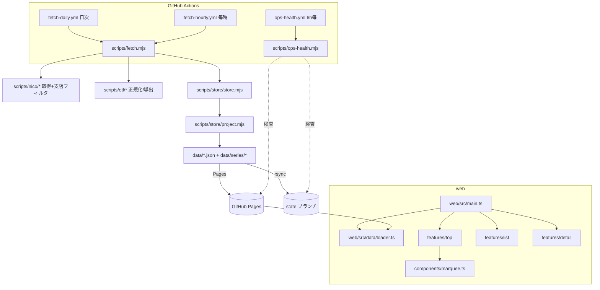

# 保守性改善・リファクタリング計画書

> **この文書の位置づけ**: 本計画書は「この計画書とリポジトリのコードだけを渡された実行者が、追加の文脈なしに作業を完遂できる」ことを目標に書かれている。実行者は本文書以外のドキュメント（`docs/` 配下の仕様書等）を読まなくても作業できるが、読んでも矛盾しないように書いてある。
>
> 行番号はすべて **commit `da42aaf` 時点**のもの。行番号がずれている場合は、各項目に併記した**関数名・識別子・近傍のコード断片**で対象を特定すること。

---

## 1. 現状理解

### 1.1 このプロジェクトが何をするものか

dアニメストア「ニコニコ支店」（niconico のチャンネル ch2632720。docomo 本店とは別サービス）の**非公式ビューア（発見 UI）**。ニコニコの公開 API から作品・各話・再生数などのメタデータを取得して静的 JSON 化し、静的サイト（GitHub Pages）で「全作品ブラウズ／人気・勢いランキング／タグ／五十音／クール／新着」を提供する。視聴は公式プレイヤーへの deep-link のみで、動画本体は扱わない。

### 1.2 技術スタック

| 層                       | 技術                                                                                                            |
| ------------------------ | --------------------------------------------------------------------------------------------------------------- |
| データ取得（`scripts/`） | Node.js ≥20・ESM（`.mjs`）・依存ライブラリなし（標準 `fetch` 使用）                                             |
| フロント（`web/`）       | Vite 5 + TypeScript 5（strict）・フレームワークなし（Vanilla TS、`innerHTML` テンプレート + DOM API）           |
| テスト                   | Vitest 2（`tests/` に 38 ファイル・567 テスト）＋ happy-dom                                                     |
| Lint/Format              | ESLint 9（flat config）＋ Prettier 3（`semi:false, singleQuote, trailingComma:es5`）。pre-commit で lint-staged |
| CI/運用                  | GitHub Actions 4 本（後述）。**push/PR で回る品質ゲート（lint/test）は存在しない**                              |
| パッケージ管理           | pnpm（lockfileVersion 9.0）。**バージョン未ピン**（CI は `version: 9` フロート指定）                            |

**重要な注意**: `tsconfig.json` の `include` は `web/src/**/*.ts`・`vite.config.ts`・`vitest.config.ts`・`tests/**/*.ts` のみ。**`scripts/`（約 5,600 行の `.mjs`）は `pnpm typecheck` の対象外**であり、store.mjs 等の JSDoc `@typedef` は現状なにも検査していない。

### 1.3 主要ディレクトリの役割

| パス                                 | 役割                                                                                                                                                                                                                  |
| ------------------------------------ | --------------------------------------------------------------------------------------------------------------------------------------------------------------------------------------------------------------------- |
| `scripts/`                           | データ取得・ETL・射影（API → `data/*.json`）。`fetch.mjs` が起点                                                                                                                                                      |
| `scripts/nico/`                      | 各データ源クライアント（snapshot / nvapi / RSS / list.json）と支店フィルタ                                                                                                                                            |
| `scripts/etl/`                       | メモリ上の変換（タグ正規化・クール・メトリクス・シリーズ導出・credits 抽出）                                                                                                                                          |
| `scripts/store/`                     | Store（JS Map の集合）と射影（Store → 用途別 JSON）                                                                                                                                                                   |
| `scripts/lib/`                       | HTTP（ToS 遅延・User-Agent）・logger                                                                                                                                                                                  |
| `data/`                              | 生成物。公開 JSON 6 本（works/ranking/tags/cours/kana/new）は**シードとして main にコミット済み**。`data/series/`（約 6,600 ファイル）と `data/state/` は git 管理外で、**orphan ブランチ `state`** に rsync で永続化 |
| `web/src/`                           | 静的フロント。`main.ts`（ルータ＋データロード）→ `features/`（top/list/detail）→ `components/`・`shared/`                                                                                                             |
| `web/src/data/loader.ts`             | `fetch('data/*.json')` ＋型ガードによるロード                                                                                                                                                                         |
| `tests/`                             | `etl/` `nico/` `store/` `web/` に分かれた Vitest テスト                                                                                                                                                               |
| `docs/`                              | 仕様書（L0〜L3）。**本計画の実行には読む必要はない**                                                                                                                                                                  |
| `.claude/skills/`・`.agents/skills/` | エージェント用 API リファレンスの複製 2 部（**現在内容が乖離している**。→ M-11）                                                                                                                                      |

### 1.4 主要な実行経路

1. **日次バッチ**（`.github/workflows/fetch-daily.yml`、22:30 UTC）: `node scripts/fetch.mjs`（`--mode=full`、`fetch.mjs:340 runFullJS`）→ snapshot API 全件・list.json・nvapi を取得 → Store 更新 → `data/*.json` 射影 → Pages デプロイ → `state` ブランチへ rsync 保存。
2. **毎時バッチ**（`.github/workflows/fetch-hourly.yml`）: `--mode=hourly`（`fetch.mjs:718 runHourlyJS`）→ チャンネル RSS の増分取得 → 新規話があれば `data/.deploy-needed` センチネルを書き（`fetch.mjs:917`）、ワークフローがその存在で Pages デプロイを分岐（`fetch-hourly.yml:94`）。
3. **運用ヘルスチェック**（`.github/workflows/ops-health.yml`、6 時間毎）: `node scripts/ops-health.mjs --ci`。Pages 上の公開 JSON・state ブランチ・Actions 実行履歴を検査し、`ci=true`（データ正しさ）の FAIL のみ exit 1（`ops-health.mjs:517`）。
4. **フロント**: `pnpm dev` / `pnpm build`。`main.ts:133 ensureData()` が 5 つの JSON を `Promise.all` でロードし、画面（top/list/detail）に渡す。

### 1.5 主要なデータフロー

```
snapshot API ─┐
list.json ────┤→ scripts/nico/*（取得・支店フィルタ channelId===2632720）
nvapi ────────┤        ↓
RSS（毎時）───┘   scripts/etl/*（タグ正規化・メトリクス・シリーズ導出）
                       ↓
              scripts/store/store.mjs（Store: episodes/series/rss の Map、増分 upsert）
                       ↓
              scripts/store/project.mjs（射影: works/ranking/tags/cours/kana/new + series/*.json）
                       ↓
              data/*.json ──→ GitHub Pages ──→ web/src/data/loader.ts → 画面
                       └──→ state ブランチ（rsync、次回実行時に復元）
```

- RSS の動画 ID（数値 watch id）と snapshot の `contentId`（`so…`）は形式が違い、毎時取得した新着はまず**負整数の仮 seriesId**（タイトルの djb2 ハッシュ、`scripts/nico/list.mjs:284 provisionalSeriesId`）に紐づき、日次で本物の seriesId に解決される。
- 「勢い（Hot）」は `viewCounter − prevViewCounter` の前日比 delta を使う（`scripts/etl/metrics.mjs`）。`prevViewCounter` は upsert 時に退避される（→ M-07 に問題あり）。

### 1.6 設定・環境変数・外部 API・永続化

- **環境変数**: `NICO_USER_AGENT`（`scripts/lib/http.mjs:31`、API マナー用 UA）／`LOG_LEVEL`（`scripts/lib/logger.mjs:8`）／`NICO_FORCE_SNAPSHOT`・`NICO_FORCE_SEED`・`NICO_SEED_ONLY`・`NICO_SEED_LIMIT`（`scripts/fetch.mjs`）／`DATA_DIR`（`scripts/reproject.mjs:23`）／`CI`・`GITHUB_SHA`（`vite.config.ts:17,22`、Pages の base パスとビルド ID）。秘密情報は GitHub Actions の `GITHUB_TOKEN` のみ。
- **外部 API**: snapshot 検索 API v2／nvapi（非公式）／チャンネル RSS／`anime.nicovideo.jp` の静的 JSON・HTML。すべて `scripts/lib/http.mjs` の `fetchWithToS`（UA 付与・≥500ms 逐次遅延）経由。**ブラウザから直接叩くことは設計上禁止**（CORS と ToS）。
- **永続化**: git のみ。main（公開 JSON シード）＋ orphan `state` ブランチ（series/・state/）。DB なし。

### 1.7 テスト・ビルド・Lint・実行コマンド

| コマンド                         | 内容                                                       | 状態                 |
| -------------------------------- | ---------------------------------------------------------- | -------------------- |
| `pnpm install --frozen-lockfile` | 依存導入                                                   | 動作する             |
| `pnpm test`                      | Vitest 567 件                                              | 全緑（da42aaf 時点） |
| `pnpm lint` / `pnpm lint:fix`    | ESLint（`.claude/**` は ignore、`.agents/**` は対象）      | 全緑                 |
| `pnpm typecheck`                 | `tsc --noEmit`（web/tests のみ）                           | 全緑                 |
| `pnpm build`                     | Vite ビルド → `dist/`                                      | 動作する             |
| `pnpm fetch`                     | データ取得（ネットワーク必須・通常はローカルで実行しない） | 動作する             |
| `pnpm ops:health`                | ヘルスチェック（ネットワーク必須）                         | 動作する             |

**仮説**: リポジトリの `AGENTS.md` にはコマンド表があり `pnpm dev`/`pnpm build` を「雛形（未実装）」と記しているが、実際は実装済みで動作する。ドキュメントの更新漏れと推測される（本計画ではドキュメントは変更しない）。

### 1.8 読み取れる設計意図（尊重すること）

1. **取得と表示の分離**: ブラウザから外部 API を叩かない。データは必ず `scripts/` → `data/*.json` 経由。
2. **支店フィルタの固定**: `channelId === 2632720` のみ採用（`scripts/nico/filter.mjs`）。API 側で filter できないため取得後にコードで絞る。
3. **決定的ビルド**: 同じ Store から同じ JSON が出ること（差分コミットの抑制と検証可能性のため)。Store のロードはファイル名ソートで順序を固定している。
4. **予測どおりに動く UI・時間を奪わない UI**: 隠れた並び替えや自動再生をしない。`prefers-reduced-motion` の尊重など。
5. **API マナー**: UA 必須・逐次アクセス・条件付き GET。

---

## 2. 構造マップ

### 2.1 依存関係（文章）

- `scripts/fetch.mjs`（1,029 行、全実行モードの起点）は `scripts/nico/*`（snapshot/list/nvapi/rss/filter/assert）、`scripts/etl/*`（tags/cours/metrics/series/credits）、`scripts/store/store.mjs`・`project.mjs`、`scripts/lib/http.mjs`・`logger.mjs` に依存している。
- `scripts/store/project.mjs` は Store を読み、`data/works.json` ほか公開 JSON 6 本と `data/series/*.json` を書き出す。`scripts/store/credit-index.mjs` を呼び出す。
- `scripts/ops-health.mjs`（523 行、自己完結スクリプト）は Pages 上の公開 JSON・`state` ブランチ・`gh` CLI（Actions 履歴）と通信する。他モジュールへの依存はない。
- チャンネル ID は 3 つの形態で 3 ファイルに分散している: 数値 `2632720`（`scripts/nico/filter.mjs:4`）、文字列 `'ch2632720'`（`scripts/nico/nvapi.mjs:14`）、URL 埋め込み（`scripts/nico/rss.mjs:7`）。→ M-08
- `web/src/main.ts`（698 行）はルータ（`features/router.ts`）とデータロード（`data/loader.ts`）を束ね、画面レンダラ `features/top/top.ts`・`features/list/list.ts`・`features/detail/detail.ts` を呼ぶ。画面は `components/*`（card/chip/marquee/tooltip 等）と `shared/*`（tag-filter/sanitize/deeplink）を使う。
- `web/src/data/loader.ts` は相対パス `data/*.json` を `fetch` し型ガードで検証する。設定値 `DATA_BASE = 'data/'` を参照する。
- 画面遷移は「`app.innerHTML = ''` で全消し → 再構築」モデル。**コンポーネントに destroy ライフサイクルはなく**、`document`/`window` に付けたリスナーは自分で解除しない限り残る（tooltip 等は自衛済み、marquee/top に漏れあり → M-04/M-05）。
- GitHub Actions: `fetch-daily.yml`・`fetch-hourly.yml` は `scripts/fetch.mjs` を実行し、`state` ブランチと GitHub Pages に書き込む。`ops-health.yml` は `scripts/ops-health.mjs` を実行する。`deploy-pages.yml` は main push 時のデプロイ。

### 2.2 依存関係図



---

## 3. 安全網の構築（項目 0 ＝ W-00。必ず最初に実行する）

### 3.1 作業ブランチ

```bash
git checkout main && git pull origin main
git switch -c refactor/maintainability-plan
```

以後の全作業項目はこのブランチ上で、**1 項目 = 1 コミット**で進める。

### 3.2 ベースライン確認（変更前に必ず全部実行し、全緑を記録する）

```bash
pnpm install --frozen-lockfile
pnpm lint        # 期待: エラー 0
pnpm typecheck   # 期待: エラー 0
pnpm test        # 期待: 38 ファイル・567 テスト全パス
pnpm build       # 期待: dist/ 生成・exit 0
```

いずれかが赤の場合は**作業を開始せず**、その事実を報告して停止すること（本計画は da42aaf 時点で全緑であることを前提にしている）。

注意: pre-commit フックで lint-staged（ESLint --fix + Prettier）が走り、コミット時にファイルが自動整形されることがある。整形された結果もそのままコミットに含めてよい。

### 3.3 特性テスト（characterization tests）の追加

後続の変更対象のうち、**既存テストで挙動が固定されていない箇所**を先にテストで固定する。新規ファイル `tests/store/characterization.test.mjs` を作成し、以下の 4 仕様を実装する。既存テストの書き方は `tests/store/store.test.mjs`・`tests/store/project.test.mjs` を参照し、`createStore()`（`scripts/store/store.mjs:94`）と `upsertEpisodes()`（同 `:511`）をそのまま使う。

#### 仕様 T-1: 新規エピソード作成時の prevViewCounter 初期値

- テスト名: `upsertEpisodes: 新規作成時は prevViewCounter=null`
- 対象: `scripts/store/store.mjs` の `upsertEpisodes`（新規側分岐、`:603-623`）
- 入力: 空 Store に `[{ contentId: 'so1', title: 'ep1', viewCounter: 100 }]` を upsert
- 期待結果: `store.episodes.get('so1')` が `viewCounter === 100`、`prevViewCounter === null`
- 固定したい既存挙動: 新規作成では prev は退避されない（`prevViewCounter: null`、`store.mjs:610`）
- 理由: W-07 が prev 退避条件を変えるため、「新規時は null」という土台を先に固定する。

#### 仕様 T-2: 同値 upsert で prevViewCounter が現在値で上書きされる（現行挙動）

- テスト名: `upsertEpisodes: 同値 upsert でも prevViewCounter が現 viewCounter で上書きされる（現行挙動）`
- 対象: `scripts/store/store.mjs:520-521`（`const prevView = existing.viewCounter` / `existing.prevViewCounter = prevView`）
- 入力: T-1 の Store に、続けてもう一度 `[{ contentId: 'so1', viewCounter: 100 }]`（同じ値）を upsert
- 期待結果: `prevViewCounter === 100`（null だったものが現在値で上書きされる）
- 固定したい既存挙動: **upsert のたびに無条件で prev = 現在値になる**。つまり値が変わらない再取り込みが挟まると前日比 delta が消える。
- 理由: これは**バグに見える挙動**だが、リファクタリング前に「現状こう動く」ことをテストで固定する。修正そのものは **W-07 が明示的に行い、そのときこのテストの期待値も併せて更新する**（勝手に直さない）。

#### 仕様 T-3: 値が変化する upsert での prev 退避

- テスト名: `upsertEpisodes: viewCounter 変化時に旧値が prevViewCounter に退避される`
- 対象: 同上
- 入力: T-2 の Store に `[{ contentId: 'so1', viewCounter: 120 }]` を upsert
- 期待結果: `viewCounter === 120`、`prevViewCounter === 100`
- 固定したい既存挙動: 変化時は旧値が prev に入る（delta = 20 が計算可能になる）。この挙動は W-07 後も**変わらない**。
- 理由: W-07 の「変えてはいけない側」の挙動を先に固定する。

#### 仕様 T-4: exportTags の出力順（タイなしフィクスチャ）

- テスト名: `exportTags: seriesCount 降順で出力される（重複数なしフィクスチャ）`
- 対象: `scripts/store/project.mjs:190 exportTags`（ソートは `:206`）
- 入力: `seriesCount` がすべて異なる 3 タグ（例: タグ A を 3 シリーズ、B を 2、C を 1 に付けた Store）で `exportTags` を実行し、出力 JSON（一時ディレクトリに書かせて読み戻す。既存 `tests/store/project.test.mjs` の書き出し方式を踏襲）を検証
- 期待結果: `tags` 配列が `[A, B, C]` の順
- 固定したい既存挙動: seriesCount 降順という主ソートキー。**同数タイのケースは意図的に含めない**（現状のタイ順は Map 挿入順依存であり、W-09 が明示タイブレークを導入する。タイ順を今固定すると W-09 と衝突する）。
- 理由: W-09 が「主キーの順序は 1 件も変えていない」ことを証明する基準になる。

#### コミット

- コミットメッセージ案: `test: リファクタリング前の特性テストを追加（prevViewCounter・exportTags 順序）`
- 完了条件: `pnpm test` が 567 + 4 = **571 件全パス**。`pnpm lint`・`pnpm typecheck` 緑。
- 戻し方: このコミットを `git revert` するだけでよい（プロダクトコードに触れていないため）。

---

## 4. 改善候補一覧

調査で発見した候補の全リスト。「採用」= 本計画の作業項目（§5）に含める。難易度・破壊リスクは 低/中/高。

| ID   | テーマ                                | 対象箇所                                                                   | 問題                                                                                                                                                                                                                                                                                         | 根拠                                                                                                         | 放置リスク                                                          | 効果                                     | 難易度 | 破壊リスク | 優先度                                                                                 | 採用                                                                                                 |
| ---- | ------------------------------------- | -------------------------------------------------------------------------- | -------------------------------------------------------------------------------------------------------------------------------------------------------------------------------------------------------------------------------------------------------------------------------------------- | ------------------------------------------------------------------------------------------------------------ | ------------------------------------------------------------------- | ---------------------------------------- | ------ | ---------- | -------------------------------------------------------------------------------------- | ---------------------------------------------------------------------------------------------------- |
| M-01 | push/PR 品質ゲートがない              | `.github/workflows/`（ci.yml 不在）                                        | lint/typecheck/test/build を強制する CI がなく、壊れたコミットが main に入れる                                                                                                                                                                                                               | workflows は fetch/deploy/ops-health の 4 本のみ                                                             | 回帰の検出が運用バッチ失敗まで遅延                                  | すべての後続変更の安全性が上がる         | 低     | 低         | **最高**                                                                               | ✔ W-02                                                                                               |
| M-02 | pnpm バージョン未ピン                 | `package.json`（`packageManager` なし）・各 workflow の `version: 9`       | CI は pnpm 9 フロート、ローカルは 10 系が入り得る。10 系で `pnpm install` すると lockfile が書き換わり CI の `--frozen-lockfile` が壊れる導線                                                                                                                                                | `pnpm-lock.yaml:1` は `lockfileVersion: '9.0'`                                                               | ある日突然 CI が全滅する                                            | 環境差異の芽を 1 行で閉じる              | 低     | 低         | 高                                                                                     | ✔ W-01                                                                                               |
| M-03 | `.deploy-needed` の保存非対称         | `fetch-daily.yml:165`（rsync）                                             | daily の state 保存だけセンチネルを exclude しないため、state 経由でセンチネルが復元され、**daily 後の最初の hourly が新規 0 件でも必ず無駄デプロイ**する                                                                                                                                    | hourly 側 `fetch-hourly.yml:135` は `--exclude='.deploy-needed'` あり                                        | 毎日 1 回の無駄デプロイ・デプロイ抑制ゲートの自己敗北               | 1 行で恒久修正                           | 低     | 低         | 高                                                                                     | ✔ W-03                                                                                               |
| M-04 | window リスナーのリーク               | `web/src/components/marquee.ts:99,176`                                     | `window.addEventListener('pointerup', resume)` が解除されず、Top 画面を訪れるたびに蓄積。クロージャ経由で detached DOM も保持                                                                                                                                                                | rAF は `viewport.isConnected` で自己停止する（`:73,146`）がリスナーは残る                                    | 長時間セッションでメモリ・リスナー増加                              | リーク根絶（他コンポーネントは自衛済み） | 低     | 低         | 高                                                                                     | ✔ W-04                                                                                               |
| M-05 | IntersectionObserver のリーク         | `web/src/features/top/top.ts:303-311`                                      | `new IntersectionObserver(...).observe(hero)` が disconnect されず再訪のたび蓄積                                                                                                                                                                                                             | 参照が保持されず解除手段がない                                                                               | 同上                                                                | 同上                                     | 低     | 低         | 高                                                                                     | ✔ W-05                                                                                               |
| M-06 | データロードが全滅型・無通知          | `web/src/main.ts:136-153 ensureData`                                       | `Promise.all` で 5 ファイル中 1 つでも失敗すると全部捨てられ、空 `catch {}` でエラーも出ない。works が読めても ranking の 404 で全画面スケルトンになる                                                                                                                                       | `:151-153` の空 catch                                                                                        | 部分障害が全面障害に化ける・原因調査もできない                      | 部分障害時も動く・console にエラーが残る | 低     | 中         | 高                                                                                     | ✔ W-06                                                                                               |
| M-07 | prevViewCounter の delta 消失         | `scripts/store/store.mjs:520-521`                                          | upsert のたび無条件に prev=現在値。日次以外（毎時 RSS 経路等）で同じ話が再 upsert されると前日比 delta が 0 になり「勢い」ランキングが不正確になる                                                                                                                                           | JSDoc 自身が「UPDATE（常に更新）」と明記（`:504-506`）＝実装は意図どおりだが設計として欠陥                   | Hot ランキングの信頼性低下（サイトの主要機能）                      | ランキング品質の回復                     | 低     | 中         | 高                                                                                     | ✔ W-07                                                                                               |
| M-08 | チャンネル ID が 3 形態に分散         | `filter.mjs:4`・`nvapi.mjs:14`・`rss.mjs:7`                                | 支店を定義する最重要定数が 3 ファイルに別形式で直書き。将来の変更・監査で見落としやすい                                                                                                                                                                                                      | §2.1 参照                                                                                                    | 変更漏れ→本店データ混入の温床                                       | 単一情報源化                             | 低     | 低         | 中                                                                                     | ✔ W-08                                                                                               |
| M-09 | ソートの決定性が暗黙依存              | `scripts/store/project.mjs:206,209-224,233-236,299-301`                    | tags/hotTop20/popularTop20/topTagsFrom/new のソートに同点タイブレークがなく、順序が Map 挿入順（=Store ロード順）に依存。「決定的ビルド」がロード側の 1 実装詳細に全乗りしている                                                                                                             | 各ソートは単一キーのみ                                                                                       | ロード順が変わる変更で出力 JSON が揺れ、無意味な diff・churn が発生 | 決定性が各ソートでローカルに保証される   | 低     | 低         | 中                                                                                     | ✔ W-09                                                                                               |
| M-10 | ops-health の誤報                     | `scripts/ops-health.mjs:414-428（U1）・447-455（U3）・457-470（U4）`       | (a) U1 は snapshot 由来の `works.latestAt` と RSS 由来の `new.pubDate` という**別源の鮮度差**を「データ正しさ (ci=true)」として FAIL させ、上流 RSS 停滞のたび通知が鳴る。(b) 仮 seriesId（負整数）は日次で解決されるまで works に現れないのに U3/U4 に猶予がなく、毎時→日次の窓で FAIL する | 実際に直近 15 run 中 7 回失敗（Actions ログで確認済み。ラグが経過時間どおり 25.5h→35.5h と伸びる＝上流停滞） | 「またいつもの失敗」化して本物の障害を見逃す                        | アラートの信頼回復                       | 低     | 中         | 高                                                                                     | ✔ W-10                                                                                               |
| M-11 | skills 複製の乖離                     | `.claude/skills/nico-snapshot-api/` と `.agents/skills/nico-snapshot-api/` | 「同一内容の複製」のはずが Prettier 整形で乖離済み（表の整形・セミコロン・`jsonc` 例への末尾カンマ挿入）。ESLint は `.claude/**` のみ ignore（`eslint.config.*:44`）、Prettier は両方対象という非対称が原因                                                                                  | `diff -rq` で SKILL.md・fetch-branch.mjs の相違を確認済み                                                    | 参照するエージェントごとに違う内容を読む・乖離が拡大                | 複製の同一性を機械的に保証               | 低     | 低         | 中                                                                                     | ✔ W-11                                                                                               |
| M-12 | `scripts/` が型検査圏外               | `tsconfig.json` の `include`                                               | 約 5,600 行の最複雑層に型検査がない。JSDoc `@typedef` は未検査の装飾                                                                                                                                                                                                                         | §1.2 参照                                                                                                    | 型起因バグの検出が実行時まで遅延                                    | 大（ただし段階導入が必要）               | 中     | 中         | 高                                                                                     | ✗（checkJs 導入は既存 JSDoc の大量エラー解消を伴い、1 コミットに収まらない。別計画で段階導入すべき） |
| M-13 | `fetch.mjs` が 1,029 行の神モジュール | `scripts/fetch.mjs` 全体                                                   | 全実行モード・調整ロジック・ETL 呼び出しが 1 ファイルに同居                                                                                                                                                                                                                                  | 行数・関数一覧                                                                                               | 変更コスト増・テスト困難                                            | 大                                       | 高     | 高         | ✗（大規模リファクタは本計画のスコープ外。M-12 の型導入後に着手する方が安全）           |
| M-14 | credits 抽出の回帰基盤欠如            | `scripts/etl/credits.mjs`                                                  | 順序依存の多段文字列変換パイプラインに実データのゴールデンコーパスがなく、修正のたび回帰リスク                                                                                                                                                                                               | tests/ に実データ fixture がない                                                                             | 「残 N 件根治」修正の反復                                           | 大                                       | 中     | 中         | ✗（state ブランチの実データから fixture を切り出す準備作業が必要。別計画）             |
| M-15 | 仮 seriesId の衝突未検知              | `scripts/nico/list.mjs:284-288`                                            | 32bit ハッシュ衝突時に別作品の各話が混線しても検知されない                                                                                                                                                                                                                                   | 実装参照                                                                                                     | 低確率だが検出不能な破損                                            | 中                                       | 中     | 中         | ✗（衝突時の代替 ID 方針という設計判断が必要。現行約 2,000 タイトルでの発生確率は低い） |
| M-16 | franchise 導出の誤結合リスク          | `scripts/etl/series.mjs`                                                   | タイトル前置一致とタグエッジの union-find で無関係作品が結合し得る                                                                                                                                                                                                                           | 実装参照                                                                                                     | 関連シリーズ表示の誤り（ベストエフォート機能）                      | 中                                       | 中     | 中         | ✗（挙動変更であり、実データでの出力比較環境が必要）                                    |
| M-17 | works.json 18MB・フォント全ウェイト   | `data/works.json`・`web/src/style.css`                                     | 初回ロードが重い                                                                                                                                                                                                                                                                             | ファイルサイズ                                                                                               | UX 劣化                                                             | 中                                       | 中     | 中         | ✗（配信戦略の変更は UX・設計判断を伴う）                                               |
| M-18 | LICENSE 不在・再配布方針の矛盾        | リポジトリ直下・`docs/`                                                    | 仕様書は「生成 JSON は再配布しない」だが public repo に works.json がコミットされている                                                                                                                                                                                                      | `git ls-files data`                                                                                          | 方針不明確                                                          | 中                                       | 低     | 中         | ✗（**リポジトリオーナーの判断事項**。実行者が決めてはいけない）                        |
| M-19 | 集計ロジックの重複                    | `scripts/store/project.mjs:44-93` と `:352-392`                            | works 全量と部分書き出しでほぼ同じ集計が 2 実装                                                                                                                                                                                                                                              | 実装参照（片方に parity コメントあり）                                                                       | 片方だけ直す事故                                                    | 中                                       | 中     | 中         | ✗（統合には両実装の完全パリティ検証が必要。M-09 完了後の方が diff 検証しやすい）       |
| M-20 | ドキュメントの実態乖離                | `AGENTS.md` のコマンド表ほか                                               | dev/build「未実装」表記等が古い                                                                                                                                                                                                                                                              | §1.7 仮説                                                                                                    | 新規参加者の混乱                                                    | 小                                       | 低     | 低         | ✗（本計画は「既存ドキュメントを変更しない」制約で作成されているため）                  |

---

## 5. 作業項目リスト

実行順。**1 項目 = 1 コミット**。各項目は前の項目が緑で完了していることを前提とする。コード例は da42aaf 時点のコードに対するスケッチであり、実際の周辺コードに合わせて機械的に適用すること（スケッチにない変更を加えてはいけない）。

> 共通完了条件（全項目）: `pnpm lint && pnpm typecheck && pnpm test` が緑であること。以下では各項目固有の条件のみ書く。
> 共通の戻し方: 各項目は独立コミットなので、問題が出たら該当コミットを `git revert` すれば他項目に影響なく戻せる（依存欄に記載がある場合を除く）。

---

### W-00: 特性テストの追加（安全網）

§3 に記載のとおり。**必ず最初に実行する。**

---

### W-01: pnpm バージョンのピン留め

- コミットメッセージ案: `chore: packageManager で pnpm を 9 系にピン留め`
- 対象箇所:
  - `package.json`（トップレベル、`"engines"` の直後あたり）
  - `.github/workflows/fetch-daily.yml:85`・`.github/workflows/deploy-pages.yml:53`・`fetch-hourly.yml`・`ops-health.yml` の `pnpm/action-setup` ステップにある `version: 9` 入力（`grep -rn 'version: 9' .github/workflows/` で全箇所を列挙できる）
- 何が問題か: pnpm のバージョンがどこにもピンされておらず、ローカル（10 系が入り得る）と CI（9 フロート）で挙動が割れる。10 系で `pnpm install` すると lockfile が書き換わる。
- どう変えるか:
  1. `package.json` に 1 行追加:
     ```json
     "packageManager": "pnpm@9.15.9",
     ```
     （9 系の最新パッチを使ってよいが、必ず**完全なバージョン番号**で書く。メジャーは 9 のまま変えない）
  2. 4 つの workflow の `pnpm/action-setup` から `with: version: 9` の指定を削除する（`uses:` 行と SHA ピンはそのまま）。`pnpm/action-setup` は `version` 入力がない場合 `packageManager` フィールドを読むため、以後は package.json が単一情報源になる。`version` 入力と `packageManager` の併存はバージョン不一致エラーの原因になるため、**両方残さない**こと。
- 変更してはいけない挙動: 依存パッケージのバージョン（`pnpm-lock.yaml` を変更しない）。workflow の他のステップ。
- 完了条件: `pnpm install --frozen-lockfile` が成功し `git status` で `pnpm-lock.yaml` に差分が出ないこと。`git diff` が package.json 1 行 + workflow 4 ファイルの `version:` 行削除のみであること。
- リスク: ローカルの pnpm が corepack 管理でない場合、`packageManager` は無視されるだけで害はない。
- 依存: なし。
- 後続項目への影響: W-02 の ci.yml は `version` 入力なしで書く（この項目が前提）。

---

### W-02: CI 品質ゲート（ci.yml）の新設

- コミットメッセージ案: `ci: push/PR で lint・typecheck・test・build を実行するワークフローを追加`
- 対象箇所: `.github/workflows/ci.yml`（新規ファイル）
- 何が問題か: lint/typecheck/test/build を強制する CI がなく、壊れた変更が main に入れる。本計画の後続項目の安全性も CI があってこそ担保される。
- どう変えるか: 以下の内容で新規作成する。`uses:` の SHA は既存 workflow（`fetch-daily.yml:63,83,87`）と同一のものを使っている——コピーして使うこと。
  ```yaml
  name: ci
  on:
    push:
      branches: [main]
    pull_request:
  permissions:
    contents: read
  concurrency:
    group: ci-${{ github.ref }}
    cancel-in-progress: true
  jobs:
    check:
      runs-on: ubuntu-latest
      timeout-minutes: 15
      steps:
        - uses: actions/checkout@df4cb1c069e1874edd31b4311f1884172cec0e10 # v6.0.3
        - uses: pnpm/action-setup@0ebf47130e4866e96fce0953f49152a61190b271 # v6.0.9
        - uses: actions/setup-node@48b55a011bda9f5d6aeb4c2d9c7362e8dae4041e # v6.4.0
          with:
            node-version: '20'
            cache: pnpm
        - run: pnpm install --frozen-lockfile
        - run: pnpm lint
        - run: pnpm typecheck
        - run: pnpm test
        - run: pnpm build
  ```
- 変更してはいけない挙動: 既存 4 workflow には触れない。
- 完了条件: `node -e "require('js-yaml')"` のような検証は不要——push 後、GitHub Actions 上で `ci` ワークフローが起動し全ステップ成功すること。push 前のローカル確認は上記 4 コマンドを手で実行して代替する。
- リスク: `pnpm build` は `CI` 環境変数下で base パスが `/nico-danime-viewer/` になる（`vite.config.ts:17`）が、ビルド成否には影響しない。
- 依存: W-01（`version` 入力なしの action-setup が `packageManager` を読むため）。
- 後続項目への影響: 以後の全項目が push 時に自動検証される。

---

### W-03: daily の state 保存から `.deploy-needed` を除外

- コミットメッセージ案: `fix(ci): daily の state 保存で .deploy-needed センチネルを除外`
- 対象箇所: `.github/workflows/fetch-daily.yml:165`（`Save state to state branch` ステップ内の rsync 行）
- 何が問題か: hourly の state 保存（`fetch-hourly.yml:135`）はセンチネル `.deploy-needed` を exclude しているが daily はしていない。daily 実行中に hourly が書いたセンチネルが state ブランチに保存されると、次回実行時の state 復元でセンチネルが復活し、**新規話が 0 件でも hourly がデプロイを実行する**（`fetch-hourly.yml:94` の存在チェックが常に真になる）。
- どう変えるか（1 行の置換）:
  ```
  # 変更前（fetch-daily.yml:165）
  rsync -av --delete --exclude='.git' src/data/. state_pub/
  # 変更後（hourly 側 :135 と同一形にする）
  rsync -av --delete --exclude='.git' --exclude='.deploy-needed' src/data/. state_pub/
  ```
- 変更してはいけない挙動: rsync の他のオプション・対象パス。hourly 側の同名ステップ。
- 完了条件: `git diff` が該当 1 行のみ。`diff <(grep rsync .github/workflows/fetch-daily.yml) <(grep rsync .github/workflows/fetch-hourly.yml)` で両者の rsync 行の exclude 指定が一致すること。
- リスク: なし（センチネルは「今回の run でデプロイが要るか」を伝えるためだけの一時ファイルで、永続化する意味がない）。
- 依存: なし。

---

### W-04: marquee の window リスナー解除

- コミットメッセージ案: `fix(web): marquee の window pointerup リスナーを再レンダー時に解除`
- 対象箇所: `web/src/components/marquee.ts` の 2 関数:
  - `initMarquee`（`:56`）: `window.addEventListener('pointerup', resume)`（`:99`）と `step` 内の切断検知（`:73-76`）
  - `initAutoScroll`（`:135`）: 同 `:176` と `:146-149`
- 何が問題か: 画面遷移（`app.innerHTML=''`）で viewport が DOM から切り離されたとき、rAF は `viewport.isConnected` チェックで自己停止するが、`window` に付けた `pointerup` リスナーは残る。Top 画面を訪れるたびに 2 個ずつ蓄積し、クロージャ経由で detached DOM を保持し続ける。
- どう変えるか: 両関数の `step` 内にある既存の切断検知分岐に、リスナー解除を 1 行ずつ追加する。
  ```ts
  // initMarquee（:72-76）— initAutoScroll（:145-149）も同型
  const step = (ts: number) => {
    if (!viewport.isConnected) {
      cancelAnimationFrame(raf) // 再レンダリングで切り離されたら停止（rAF の累積を防ぐ）
      window.removeEventListener('pointerup', resume) // ← 追加
      return
    }
  ```
  `resume` は両関数とも `addEventListener` に渡したものと同じ関数参照なので、そのまま `removeEventListener` に渡せば解除できる。viewport 自身に付けたリスナー（pointerenter 等）は viewport ごと GC されるため解除不要——**触らない**。
- 変更してはいけない挙動: マーキーの自動送り速度・一時停止/再開・reduced-motion 時の無効化・ホイール変換。`prefers-reduced-motion: reduce` のときは rAF 自体は回っている（`:81` で送りだけ止める設計）ため、この修正はそのまま機能する。
- 完了条件: `pnpm test`（`tests/web/top.test.ts` を含む）緑。手動確認（任意・可能なら）: `pnpm dev` でトップ→一覧→トップと 3 回往復し、DevTools の `getEventListeners(window).pointerup`（Chrome コンソール）が増え続けないこと。
- リスク: 低。切断検知が発火する前（初回 rAF 前）に遷移した場合はリスナーが 1 回分残るが、次の rAF tick で必ず発火するため実害はない。
- 依存: なし。

---

### W-05: top.ts の IntersectionObserver 解除

- コミットメッセージ案: `fix(web): Top のヒーロー IntersectionObserver を再レンダー時に disconnect`
- 対象箇所: `web/src/features/top/top.ts:300-311`（`renderTop` 内、`// ヒーローが見えている間はヘッダ検索ボタンを非表示にする` のコメント直下）
- 何が問題か: `new IntersectionObserver(...).observe(hero)` の参照がどこにも保持されず、disconnect する手段がない。renderTop が呼ばれるたびに新しい observer が作られ蓄積する。
- どう変えるか: モジュールレベルに observer 変数を持ち、renderTop のたびに前回分を disconnect してから作り直す。

  ```ts
  // モジュールトップレベル（import 群の後）に追加:
  let heroObserver: IntersectionObserver | null = null

  // :303-311 を次のように変更:
  const hero = container.querySelector<HTMLElement>('.hero')
  const headerSearchBtn = container.querySelector<HTMLElement>('.header-search-btn')
  heroObserver?.disconnect() // 前回レンダー分を解除（蓄積防止）
  heroObserver = null
  if (hero && headerSearchBtn && 'IntersectionObserver' in window) {
    heroObserver = new IntersectionObserver(
      (entries) => {
        const visible = entries[0]?.isIntersecting ?? true
        headerSearchBtn.setAttribute('aria-hidden', visible ? 'true' : 'false')
      },
      { threshold: 0 }
    )
    heroObserver.observe(hero)
  }
  ```

- 変更してはいけない挙動: ヘッダ検索ボタンの表示/非表示ロジック（コールバック本体・threshold）。
- 完了条件: `pnpm test` 緑（`tests/web/top.test.ts`）。`pnpm typecheck` 緑。
- リスク: 低。Top 以外の画面では observer が残るが、次に Top を訪れた時点で必ず解除される（常に高々 1 個）。
- 依存: なし。

---

### W-06: データロードの部分デグラデーション化

- コミットメッセージ案: `fix(web): データロードを Promise.allSettled 化し部分障害で全滅しないようにする`
- 対象箇所: `web/src/main.ts:133-154`（`async function ensureData`）
- 何が問題か: 5 ファイルを `Promise.all` でロードしているため 1 つの失敗で全 reject → 空 `catch {}`（`:151-153`）で握りつぶされ、works.json が読めていても ranking.json の 404 で全画面がスケルトンのままになる。エラーが console にも出ないため調査もできない。
- どう変えるか: `ensureData` 本体を次の形に置き換える（try/catch は不要になる）:
  ```ts
  async function ensureData(): Promise<void> {
    if (cache.works !== null) return
    function settle<T>(r: PromiseSettledResult<T>, name: string): T | null {
      if (r.status === 'fulfilled') return r.value
      console.error(`[data] ${name} の読み込みに失敗:`, r.reason) // 部分障害を可視化（従来は無音）
      return null
    }
    const [worksRes, rankingRes, tagsRes, coursRes, newRes] = await Promise.allSettled([
      loadWorks(),
      loadRanking(),
      loadTags(),
      loadCours(),
      loadNew(),
    ])
    const tags = settle(tagsRes, 'tags.json')
    // UI 非表示タグを除外（§68 クール由来＋§C 構造的定番＝最終回/神回/総集編/各話番号）。
    // クール絞り込みは別 UI、構造タグはノイズ。データ（works.tags/tags.json）は保持。
    if (tags) {
      tags.tags = tags.tags.filter((t) => !isHiddenTag(t.name))
      tags.topHotTags = withoutHiddenTagNames(tags.topHotTags)
      tags.topPopularTags = withoutHiddenTagNames(tags.topPopularTags)
    }
    cache = {
      works: settle(worksRes, 'works.json'),
      ranking: settle(rankingRes, 'ranking.json'),
      tags,
      cours: settle(coursRes, 'cours.json'),
      newData: settle(newRes, 'new.json'),
    }
  }
  ```
  既存の非表示タグ除外ブロック（`:145-149`）はコメントごと上記のとおり移設する。**新しい UI（エラーバナーや再試行ボタン）は追加しない**——各画面は既に `cache` の各値が null のときスケルトン/欠落表示で動くよう書かれており、その挙動をそのまま使う。
- 変更してはいけない挙動: 全ソース成功時の画面表示（従来と完全に同一であること）。`cache.works !== null` の再入ガード。UI の見た目。
- 完了条件: `pnpm typecheck`・`pnpm test` 緑（特に `tests/web/` 全部）。手動確認: `pnpm dev` を起動しトップが従来どおり表示されること。さらに DevTools の Network タブで `ranking.json` をブロック（右クリック→Block request URL）してリロードし、(a) 一覧・作品カードは表示される、(b) console に `[data] ranking.json の読み込みに失敗:` が出る、の 2 点を確認。
- リスク: 中。部分成功時、失敗ソースはページリロードまで null のまま（従来は「全部失敗→次の遷移で再試行」だった）。これは意図的な仕様選択であり、従来の「1 つでも失敗したら全部捨てて次回全再試行」より画面が使える分だけ良い、と判断している。
- 依存: なし。
- 後続項目への影響: なし。

---

### W-07: prevViewCounter の条件付き退避（★挙動変更を含む項目）

- コミットメッセージ案: `fix(store): viewCounter 実変化時のみ prevViewCounter を退避（delta 消失防止）`
- 対象箇所: `scripts/store/store.mjs`
  - `:520-521`（`upsertEpisodes` 内の `const prevView = existing.viewCounter` / `existing.prevViewCounter = prevView`）
  - `:499-510` の JSDoc（`UPDATE（常に更新）: viewCounter, prevViewCounter=現 viewCounter, ...` の記述）
  - `tests/store/characterization.test.mjs` の仕様 T-2（W-00 で追加したもの）
- 何が問題か: upsert のたびに無条件で `prevViewCounter = 現 viewCounter` にするため、値が変わらない再取り込み（毎時 RSS 経路や同日 2 回目のパス）が挟まると直前の変化分が消え、前日比 delta が 0 になる。「勢い」ランキング（`scripts/etl/metrics.mjs` が `viewCounter − prevViewCounter` を使う）が不正確になる。
- どう変えるか:

  ```js
  // 変更前（:520-521）
  const prevView = existing.viewCounter // 旧 viewCounter を prev に退避
  existing.prevViewCounter = prevView

  // 変更後
  // 実変化時のみ退避（同値再取り込みで delta が消えるのを防ぐ）
  if (raw.viewCounter != null && raw.viewCounter !== existing.viewCounter) {
    existing.prevViewCounter = existing.viewCounter
  }
  ```

  あわせて:
  1. `:505` 付近の JSDoc を実態に合わせる（`prevViewCounter=現 viewCounter` → `prevViewCounter は viewCounter 実変化時のみ旧値へ更新`）。
  2. W-00 の特性テスト T-2 の期待値を更新する: 同値 upsert 後の `prevViewCounter` は `100` ではなく **`null` のまま**（テスト名も `（現行挙動）` を外し `同値 upsert では prevViewCounter を更新しない` に変える）。T-1・T-3 は**変更なしで通ること**（通らなければ実装が間違っている）。

- 変更してはいけない挙動: viewCounter 変化時の退避（T-3）。新規作成時の `prevViewCounter: null`（T-1）。`changed` フラグと `lastUpdated`/dirty 管理（`:523-595`）。metrics の計算式そのもの（`scripts/etl/metrics.mjs` には触らない）。
- 完了条件: `pnpm test` 緑（`tests/store/store.test.mjs`・`tests/store/characterization.test.mjs`・`tests/etl/metrics.test.mjs` を含む）。`git diff` の対象が store.mjs（実装 + JSDoc）と characterization.test.mjs のみであること。
- リスク: 中（数値挙動の変更）。delta の「消えすぎ」が直る方向の変化であり、既存 metrics テストが緑なら計算式は無傷。デプロイ後 1〜2 日は Hot ランキングの数値が従来より大きく出る可能性がある（消えていた delta が保持されるため）——これは修正の意図どおり。
- 戻し方: このコミットの revert（テスト期待値も一緒に戻る）。
- 依存: **W-00**（特性テストが先に存在すること）。
- 後続項目への影響: なし。

---

### W-08: チャンネル定数の一元化（scripts/config.mjs 新設)

- コミットメッセージ案: `refactor(scripts): 支店チャンネル定数を scripts/config.mjs に一元化`
- 対象箇所:
  - `scripts/config.mjs`（新規）
  - `scripts/nico/filter.mjs:4`（`export const BRANCH_CHANNEL_ID = 2632720`）
  - `scripts/nico/nvapi.mjs:14`（`export const BRANCH_CHANNEL = 'ch2632720'`）
  - `scripts/nico/rss.mjs:7`（`const RSS_URL = 'https://ch.nicovideo.jp/ch2632720/video?rss=2.0'`）
- 何が問題か: プロジェクトの正しさを定義する最重要定数（支店チャンネル）が 3 ファイルに 3 形式で直書きされており、単一情報源がない。
- どう変えるか:
  1. 新規 `scripts/config.mjs`:
     ```js
     // scripts/config.mjs
     // 支店チャンネル定数の単一情報源。dアニメストア ニコニコ支店 = ch2632720。
     // 本店（docomo）は対象外。この値を変えるとサイト全体の対象チャンネルが変わる。
     export const BRANCH_CHANNEL_ID = 2632720
     export const BRANCH_CHANNEL = `ch${BRANCH_CHANNEL_ID}`
     export const BRANCH_RSS_URL = `https://ch.nicovideo.jp/${BRANCH_CHANNEL}/video?rss=2.0`
     ```
  2. `filter.mjs`: 定義行を `import { BRANCH_CHANNEL_ID } from '../config.mjs'` + `export { BRANCH_CHANNEL_ID }` に置き換える（**re-export を残す**ことで他ファイルの import 文を変えない）。
  3. `nvapi.mjs`: 同様に `import { BRANCH_CHANNEL } from '../config.mjs'` + `export { BRANCH_CHANNEL }` に置き換える。
  4. `rss.mjs`: `const RSS_URL = ...` を `import { BRANCH_RSS_URL } from '../config.mjs'` にし、ファイル内の `RSS_URL` 参照（`:18` と `fetchRssMultiPage` 内 `:40` 付近の 2 箇所）を `BRANCH_RSS_URL` に置換する。
- 変更してはいけない挙動: 3 定数の**値**（`2632720` / `'ch2632720'` / RSS URL 文字列が変更前後でバイト単位に同一であること）。各モジュールの公開 API（`filter.mjs` と `nvapi.mjs` からの named export は残す）。
- 完了条件: `pnpm test` 緑（`tests/nico/filter.test.mjs`・`nvapi.test.mjs`・`rss.test.mjs` を含む）。`node -e "import('./scripts/config.mjs').then(m => console.log(m.BRANCH_CHANNEL_ID, m.BRANCH_CHANNEL, m.BRANCH_RSS_URL))"` の出力が `2632720 ch2632720 https://ch.nicovideo.jp/ch2632720/video?rss=2.0` であること。`grep -rn '2632720' scripts/ --include='*.mjs' | grep -v config.mjs | grep -v '^\S*:.*//'` でコード中の直書きが残っていないこと（コメント・`assert.mjs:60` のようなログ文字列は残ってよい）。
- リスク: 低（値は同一・機械的置換）。
- 依存: なし。

---

### W-09: 射影ソートへの明示タイブレーク追加

- コミットメッセージ案: `fix(store): 射影の全ソートに決定的タイブレークを追加`
- 対象箇所: `scripts/store/project.mjs` の 5 ソート:

  | 場所                                         | 対象                | 現在のキー           | 追加するタイブレーク                                                            |
  | -------------------------------------------- | ------------------- | -------------------- | ------------------------------------------------------------------------------- |
  | `:206`（`exportTags` 内 `const tags = ...`） | tags.json           | seriesCount DESC     | name ASC（`<`/`>` の素朴比較。localeCompare は環境依存のため使わない）          |
  | `:209-215`（`hotTop20`）                     | topHotTags の元     | hotScore DESC        | seriesId ASC                                                                    |
  | `:217-224`（`popularTop20`）                 | topPopularTags の元 | totalViews DESC      | seriesId ASC                                                                    |
  | `:233-236`（`topTagsFrom` 内）               | topHot/PopularTags  | 出現数 DESC          | name ASC                                                                        |
  | `:299-301`（`exportNew` 内 `rssItems`）      | new.json            | pubDate（epoch）DESC | watchId DESC（数値文字列なので `Number(b.watchId) - Number(a.watchId)` で比較） |

- 何が問題か: 同点時の順序が JS の安定ソート＋Map 挿入順（= Store のロード順）で決まっており、「決定的ビルド」がロード実装の詳細（ファイル名ソート）に暗黙依存している。ロード順に影響する将来変更で出力 JSON が無意味に揺れる。
- どう変えるか（スケッチ、tags の例）:
  ```js
  // 変更前（:206）
  const tags = [...tagMap.values()].sort((a, b) => b.seriesCount - a.seriesCount)
  // 変更後
  const tags = [...tagMap.values()].sort(
    (a, b) => b.seriesCount - a.seriesCount || (a.name < b.name ? -1 : a.name > b.name ? 1 : 0)
  )
  ```
  他の 4 箇所も同じパターン（`主キー比較 || タイブレーク比較`）で書く。
  あわせて `tests/store/project.test.mjs` にタイケースのテストを追加する:
  - `exportTags: seriesCount 同数タイは name 昇順`（同数 2 タグ→名前順を断言)
  - `exportNew: pubDate 同時刻タイは watchId 降順`（同 pubDate 2 件→watchId 降順を断言)
- 変更してはいけない挙動: 主キーの順序（W-00 の T-4 が緑のままであること）。件数の切り出し（top20/top10/100 件）。出力 JSON のフィールド構成。
- 完了条件: `pnpm test` 緑（既存 `tests/store/project.test.mjs` の全テスト＝主キー挙動が無傷であることの証明、＋新規タイテスト）。参考（任意・実データがある環境のみ）: `state` ブランチのデータで `node scripts/reproject.mjs` を変更前後で実行し `data/*.json` の diff がゼロであること（実データはロード順が決定的なため、タイブレーク追加で出力は変わらないはず。変わった場合はそれ自体が「挿入順依存だった」証拠であり、diff 内容を報告すること）。
- リスク: 低。合成フィクスチャではタイ順が変わり得るが、それこそが本項目の目的。
- 依存: W-00（T-4 が基準線）。
- 後続項目への影響: なし。

---

### W-10: ops-health の誤報修正（U1 の格下げと仮 ID の除外）

- コミットメッセージ案: `fix(ops): U1 を鮮度シグナルに格下げし仮 seriesId を U3/U4 から除外`
- 対象箇所: `scripts/ops-health.mjs` の `checkUserVisible()`（`:397-472`）:
  - U1 の `fail(...)` 呼び出し（`:422-423`）
  - U3 の `leaked` 算出（`:448`）
  - U4 の `refs` 構築（`:458-462`）
- 何が問題か:
  - U1 は snapshot 由来の `works.latestAt` 最大と RSS 由来の `new.json pubDate` 最大の差を測るが、これは**別々の上流源の鮮度差**であり、自分のパイプラインの「データ正しさ」ではない。上流 RSS が停滞するたびに `ci=true` の FAIL → `--ci` で exit 1 → 通知が鳴る（直近の定期失敗の主因）。
  - 仮 seriesId（負整数、毎時 RSS で作られ日次で本物に解決される）は解決までの窓で works と series-index の集合がずれるのが正常だが、U3/U4 に猶予がなく FAIL する。
- どう変えるか:
  1. U1 の FAIL を `ci=false`（鮮度シグナル）に変える。`fail()` の第 4 引数が ci フラグ（`:80`、デフォルト true）:
     ```js
     // 変更前（:422-423）
     if (lagMin > UV.newLag)
       fail(G, 'U1 新着反映ラグ', `新着リストが本体に追随せず ${detail}（>${UV.newLag / 60}h）`)
     // 変更後（第4引数 false を追加。上流源同士の鮮度差＝運用シグナルであり --ci 通知対象にしない）
     if (lagMin > UV.newLag)
       fail(
         G,
         'U1 新着反映ラグ',
         `新着リストが本体に追随せず ${detail}（>${UV.newLag / 60}h）`,
         false
       )
     ```
  2. U3: 仮 ID を除外する。
     ```js
     // 変更前（:448）
     const leaked = [...idxVals].filter((id) => !worksIds.has(id))
     // 変更後（負= provisional。日次解決までの窓で works に無いのは正常）
     const leaked = [...idxVals].filter((id) => !worksIds.has(id) && Number(id) > 0)
     ```
  3. U4: refs 構築の works ループ（`:459-460`）に同様の除外を足す。
     ```js
     // 変更前
     if (w.isAvailable !== false && (w.episodeCount ?? 0) >= 1) refs.add(String(w.seriesId))
     // 変更後（provisional は series 実体を持たなくて正常）
     if (w.isAvailable !== false && (w.episodeCount ?? 0) >= 1 && w.seriesId > 0)
       refs.add(String(w.seriesId))
     ```
  4. ファイル冒頭付近（`:41-45` の UV 定義コメントや `:395-396` の U1〜U4 説明コメント）を実態に合わせて 1〜2 行更新する（U1 は ci=false である旨）。
- 変更してはいけない挙動: U2（取り込みストール）と構造健全性チェック群・FLOORS（`:48-56`）・exit code の決定ロジック（`:483-517`）。U1 の**しきい値**（`UV.newLag`）と PASS/FAIL の判定式そのもの（変えるのは ci フラグだけ）。
- 完了条件: `pnpm lint` 緑・`node --check scripts/ops-health.mjs` が成功。`grep -n "U1 新着反映ラグ" scripts/ops-health.mjs` で fail 呼び出しの第 4 引数が `false` であることを目視確認。ネットワークが使える環境なら `pnpm ops:health -- --json | node -e "let s='';process.stdin.on('data',d=>s+=d).on('end',()=>{const r=JSON.parse(s);const u1=r.results.find(x=>x.label.startsWith('U1'));console.log(u1)})"` で U1 レコードの `ci` が `false` であることを確認（`--json` の出力キー構成が異なる場合は出力をそのまま目視確認でよい）。使えない環境ではコードレビューのみで完了とする。
- リスク: 低。「本物の U1 異常」も --ci 通知からは外れるが、6 時間毎の通常実行（`--ci` なし）では引き続き FAIL 表示される。U2（自パイプラインのストール、ci=true のまま）が実害検知を担う。
- 依存: なし。
- 後続項目への影響: なし。

---

### W-11: skills 複製の再同期と同一性の機械的保証

- コミットメッセージ案: `fix: .agents/skills を .claude/skills に再同期し同一性テストと prettierignore を追加`
- 対象箇所:
  - `.agents/skills/nico-snapshot-api/`（SKILL.md と scripts/fetch-branch.mjs が `.claude/` 側と乖離。`diff -rq .claude/skills .agents/skills` で確認できる）
  - `.prettierignore`（4 行のファイル。dist/・node_modules/・data/・pnpm-lock.yaml）
  - `tests/skills-sync.test.mjs`（新規）
- 何が問題か: 2 つの skills ディレクトリは「同一内容の複製」という運用のはずだが、Prettier が `.agents/` 側だけを整形して乖離している（ESLint は `.claude/**` を ignore するが Prettier はどちらも対象、という設定非対称が原因）。`jsonc` コード例に Prettier が末尾カンマを注入するなどドキュメントとしての品質も落ちている。参照するツールによって読む内容が違う状態。
- どう変えるか（3 手で 1 コミット）:
  1. `.prettierignore` に 2 行追加（整形対象から両複製を外し、以後の乖離を防ぐ）:
     ```
     .claude/skills/
     .agents/skills/
     ```
  2. `.claude/` 側を正として複製を作り直す:
     ```bash
     rm -rf .agents/skills/nico-snapshot-api
     cp -R .claude/skills/nico-snapshot-api .agents/skills/nico-snapshot-api
     ```
  3. 新規 `tests/skills-sync.test.mjs`: 2 ディレクトリ配下の全ファイルについて相対パス集合と各ファイル内容（バイト列）が一致することを断言するテストを書く（`node:fs` の `readdirSync(..., { recursive: true })` と `readFileSync` で実装できる。外部ライブラリは追加しない）。
     - テスト名例: `skills 複製: .claude/skills と .agents/skills は同一内容`
- 変更してはいけない挙動: `.claude/skills/` 側の内容（1 バイトも変更しない）。`.prettierignore` の既存 4 行。
- 完了条件: `diff -rq .claude/skills .agents/skills` が出力なし（完全一致）。`pnpm test` 緑（新テスト含む）。`pnpm lint` 緑。さらに `pnpm exec prettier --check .agents/skills/nico-snapshot-api/SKILL.md` が「ignored」扱いで通ること（＝再整形されないこと。コミット時に pre-commit の lint-staged が `.agents/` 側を再整形して diff が出たら .prettierignore の追記が効いていないので見直す）。
- リスク: 低。`.agents/` 側だけを参照していたツールから見ると整形が戻るが、内容（情報）は `.claude/` 側と同一になる。
- 依存: なし。

---

## 6. 実行順の妥当性チェック（トレース済み）

W-00 から W-11 まで順にトレースした結果:

- **依存関係**: W-02 → W-01（action-setup の version 入力削除が先）、W-07 → W-00（特性テスト T-2 の期待値更新を伴うため）、W-09 → W-00（T-4 が主キー不変の基準線）。それ以外は相互独立。依存の逆転はない。
- **前の項目が後の項目の説明を無効化しないか**: 行番号が動くのは W-06（main.ts）・W-07（store.mjs）・W-09（project.mjs）・W-10（ops-health.mjs）だが、これらは互いに別ファイルであり衝突しない。同一ファイルを 2 回触る項目はない（marquee.ts は W-04 のみ、top.ts は W-05 のみ）。W-01 と W-02 は同じ `.github/workflows/` を触るが別ファイル。
- **行番号ずれ耐性**: 全項目に関数名（`upsertEpisodes`・`exportTags`・`ensureData`・`checkUserVisible` 等）と近傍のコード断片・コメント文字列を併記した。行番号が合わなくても識別子で特定できる。
- **粒度**: 最大の項目は W-06（1 関数の書き換え約 30 行）と W-11（コピー + テスト 1 本）。いずれも 1 コミットとしてレビュー可能な大きさ。
- **独立検証**: 全項目が「lint + typecheck + test ＋項目固有の確認コマンド」で単独検証できる。ネットワーク必須の確認（W-10 の ops:health 実行、W-09 の実データ diff）は**任意**とし、代替のオフライン確認手順を併記した。
- **中断安全性**: どの項目の直後で中断してもリポジトリは全テスト緑・デプロイ可能な状態。挙動変更を含むのは W-06（部分障害時の劣化動作）と W-07（prev 退避条件）のみで、どちらも単独 revert 可能。
- **解釈余地**: 「整理する」等の曖昧語は作業項目に含めていない。判断が入り得る箇所（W-06 の関数全体・W-07 の条件式・W-10 の 3 箇所・W-11 の同期方向）はすべて変更前後のコードまたはコマンドで固定した。

**計画全体のリスク**: (1) W-06/W-07 は挙動変更を含むため、デプロイ後数日は Hot ランキングと部分障害時の表示を観察すること。(2) 本計画は da42aaf 時点のコードを前提としており、main が大きく進んでいる場合は各項目の「変更前」コードが一致するかを先に確認し、一致しない項目はスキップして報告すること。

---

## 7. やらないことリスト（実行者への禁止事項）

以下を**してはいけない**。計画書に書かれていない「ついでの改善」も全部禁止。

1. **機能追加をしない**（新しい画面・新しい UI 要素・新しいデータ項目を作らない。W-06 でもエラーバナーや再試行ボタンは追加しない）。
2. **仕様変更をしない**（例外は W-06・W-07 のみ。各項目に書かれた範囲を 1 ミリも超えない）。
3. **UI/UX 変更をしない**（見た目・文言・並び順・アニメーションを変えない。W-09 のタイブレークは「同点時の未定義順序の固定」であり表示仕様の変更ではない）。
4. **依存ライブラリを更新しない**（`package.json` の dependencies/devDependencies と `pnpm-lock.yaml` に触らない。W-01 の `packageManager` 追加は依存更新ではない）。
5. **フレームワーク・ツールを変更しない**（Vite/Vitest/ESLint/Prettier の設定変更禁止。例外: W-11 の `.prettierignore` 2 行追加のみ）。
6. **ディレクトリ構成の大規模変更をしない**（ファイル移動・リネーム禁止。新規作成は本計画に列挙したファイルのみ: `tests/store/characterization.test.mjs`・`.github/workflows/ci.yml`・`scripts/config.mjs`・`tests/skills-sync.test.mjs`）。
7. **public API・外部 I/F・設定形式・保存形式を変更しない**（`data/*.json` のスキーマ・`state` ブランチのレイアウト・URL 形式・localStorage キーを変えない）。
8. **テストを通すために期待値を都合よく変更しない**（期待値変更が許されるのは W-07 の T-2 のみ。他のテストが落ちたら原因を調べて報告する）。
9. **Formatter の全体適用だけの巨大差分を作らない**（`prettier --write .` の一括実行禁止。pre-commit が staged ファイルに掛ける整形はそのまま受け入れてよい）。
10. **無関係なファイルを触らない**（各項目の「対象箇所」に列挙されたファイル以外を変更しない）。
11. **大規模リライトをしない**（`fetch.mjs` 分割・型導入・credits 改修などは M-12〜M-19 として明示的に本計画から除外してある）。
12. **計画書にない作業を勝手に追加しない**（改善点に気づいたら実装せず報告に書く）。
13. **このリポジトリ固有の禁止**: `data/series/`・`data/state/` をコミットしない／`channelId === 2632720` の支店フィルタの値・適用箇所を変えない／ブラウザから外部 API を直接叩くコードを書かない／`state` ブランチに push しない／`docs/` 配下の仕様書を変更しない／`pnpm fetch` を不必要に実行しない（外部 API へのアクセスマナー）。

**例外条件**: W-06・W-07 は挙動変更を含むが、各項目に書かれたスケッチの範囲内でのみ許可する。スケッチどおりに実装できない事情（周辺コードの相違等）が見つかった場合は、実装せずその内容を報告すること。

---

## 8. 実行者への指示文（コピペ用）

```
リポジトリ直下の docs/l3_phases/refactor-maintainability-plan/plan.md が作業計画書です。
以下のルールで実行してください。

1. 計画書 §3（W-00）から始め、§5 の作業項目を W-00 → W-11 の順に 1 項目ずつ実施すること。
2. 1 項目ごとに、その項目のコミットメッセージ案を使って 1 コミットを作ること。
   複数項目をまとめたコミットを作らないこと。
3. 各項目の「完了条件」をすべて満たしてから次の項目に進むこと。
   共通完了条件は pnpm lint && pnpm typecheck && pnpm test が全緑であること。
4. 完了条件を満たせない場合は、その項目の作業を中断し、変更を revert したうえで
   何がどう失敗したかを報告すること。勝手に回避策を実装しないこと。
5. 計画書に書かれていない作業をしないこと。§7「やらないことリスト」を毎項目の
   着手前に確認すること。
6. 仕様変更・依存ライブラリ更新・設定変更が必要に見えた場合は、実施せずに
   「どの項目で・なぜ必要に見えたか」を報告すること。
7. テストが失敗した場合、テストの期待値を書き換えて通すことを禁止する
   （唯一の例外は W-07 に明記された T-2 の期待値更新）。原因を調べて報告すること。
8. 各項目の「変更前」として計画書に引用されているコードが実際のコードと一致しない
   場合は、その項目をスキップして相違内容を報告すること。
9. 判断に迷う箇所があれば、実装せずに質問または報告すること。
10. すべての項目が完了したら、実施した項目・スキップした項目・各完了条件の結果を
    一覧にして報告すること。
```

---

## 9. 最初に着手すべき最小の一歩

**W-00: 特性テストの追加（§3）**

- **なぜ最初か**: 後続で挙動を変える箇所（W-07 の prev 退避）と挙動を変えてはいけない箇所（W-09 のソート主キー）の両方に、変更前の挙動を固定する網を張るため。これがないと W-07/W-09 の「壊していない」証明ができない。プロダクトコードに 1 行も触れないため、リスクもゼロ。
- **触るファイル**: `tests/store/characterization.test.mjs`（新規）のみ。
- **守る挙動**: なし（テスト追加のみ）。ただし既存 567 テストが引き続き全緑であること。
- **完了判断**: `pnpm test` で 571 件（567 + 4）全パス、`pnpm lint`・`pnpm typecheck` 緑。
- **失敗した場合**: 新規テストファイルを削除すれば元どおり（ベースライン確認 §3.2 の状態に戻る）。ベースライン自体が赤だった場合は作業全体を開始しない。
